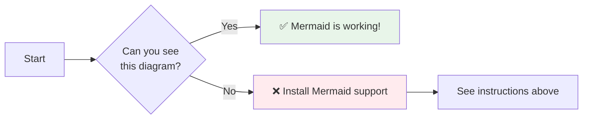

# Documentation Diagrams Overview

This document provides an overview of all diagrams included in the URL Shortener Platform documentation.

## How to View Diagrams

The diagrams in this documentation are written in **Mermaid** syntax. You can view them in:

1. **GitHub**: Diagrams render automatically when viewing `.md` files on GitHub
2. **VS Code**: Install the "Markdown Preview Mermaid Support" extension
3. **Mermaid Live Editor**: Copy diagram code to https://mermaid.live/
4. **Other Markdown Viewers**: Most modern Markdown viewers support Mermaid

---

## Diagram Inventory

### 01-architecture.md (7 diagrams)

#### 1. System Context Diagram
**Location**: Line 25  
**Type**: Graph (TB - Top to Bottom)  
**Purpose**: Shows high-level system context with external actors and AWS components  
**Components**: Anonymous User, Authenticated User, Amplify, CloudFront, API Gateway, Cognito, DynamoDB, CloudWatch, SNS

#### 2. High-Level Component Diagram
**Location**: Line 74  
**Type**: Graph (TB - Top to Bottom)  
**Purpose**: Detailed component architecture with all AWS services, IAM roles, and connections  
**Components**: 
- Client Layer (Browser, Mobile)
- Frontend Hosting (Amplify)
- CDN & Edge (CloudFront, S3)
- API Layer (API Gateway, Authorizer)
- Authentication (Cognito, Hosted UI)
- Data Layer (DynamoDB, Indexes)
- IAM Roles (4 roles)
- Monitoring & Alerting (CloudWatch, 5 alarms, SNS)
- External Integration (GitHub)
- Certificate Management (ACM)

**Features**: Color-coded by function (frontend=blue, API=orange, data=purple, auth=green, monitoring=pink, IAM=yellow)

#### 3. Create Short Link Sequence Diagram
**Location**: Line 386  
**Type**: Sequence Diagram  
**Purpose**: Shows the flow of creating a new short link  
**Participants**: User, Browser/SPA, Cognito, API Gateway, DynamoDB  
**Key Steps**: Form submission, JWT validation, VTL transformation, DynamoDB UpdateItem, error handling

#### 4. List User's Links Sequence Diagram
**Location**: Line 426  
**Type**: Sequence Diagram  
**Purpose**: Shows the flow of listing user's links  
**Participants**: User, Browser/SPA, Cognito, API Gateway, DynamoDB OwnerIndex  
**Key Steps**: Dashboard load, JWT validation, Query on GSI, VTL transformation, rendering

#### 5. Public Redirect Sequence Diagram
**Location**: Line 464  
**Type**: Sequence Diagram  
**Purpose**: Shows the flow of public link redirection  
**Participants**: User, Browser, CloudFront, API Gateway, DynamoDB  
**Key Steps**: Click link, CloudFront cache check, DynamoDB GetItem, 301 redirect, browser follow

#### 6. MFA Authentication Flow Diagram
**Location**: Line 794  
**Type**: Sequence Diagram  
**Purpose**: Shows TOTP MFA enrollment and subsequent authentication  
**Participants**: User, Browser, Cognito, API Gateway, Authenticator App  
**Key Steps**: 
- First-time setup: Generate QR code, scan, verify, enable
- Subsequent sign-ins: Enter TOTP code, authenticate

#### 7. Error Handling Flow Diagram
**Location**: Line 850  
**Type**: Graph (TB - Top to Bottom)  
**Purpose**: Shows error handling and recovery paths  
**Components**: Request flow, JWT validation, throttling, DynamoDB operations, error codes (401, 429, 400, 503, 500), CloudWatch logging, alarms, SNS notifications  
**Features**: Color-coded errors (4xx=light red, 5xx=dark red, success=green)

---

### 02-deployment.md (1 diagram)

#### 8. Deployment Flow Diagram
**Location**: Line 15  
**Type**: Graph (TB - Top to Bottom)  
**Purpose**: Shows complete deployment workflow from prerequisites to verification  
**Steps**: 
- Prerequisites check
- Tool installation
- AWS configuration
- Repository cloning
- GitHub token creation
- Deployment method selection (guided/script/manual)
- SAM validation and packaging
- CloudFormation stack creation
- Resource provisioning
- Amplify configuration
- Build trigger
- DNS configuration (optional)
- Verification and monitoring

**Features**: Color-coded stages (start=blue, complete=green, debug=red, resources=orange)

---

### 03-configuration.md (1 diagram)

#### 9. Configuration Overview Diagram
**Location**: Line 12  
**Type**: Graph (LR - Left to Right)  
**Purpose**: Shows different types of configuration and when they apply  
**Components**:
- Deployment Time: CloudFormation Parameters → Stack Creation → Resources
- Runtime Configuration: Environment Variables, VTL Templates, IAM Roles
- Monitoring Configuration: CloudWatch Alarms, Log Retention

**Features**: Color-coded by configuration type (deployment=blue, runtime=purple/orange, monitoring=red)

---

### 04-development.md (1 diagram)

#### 10. Development Workflow Diagram
**Location**: Line 12  
**Type**: Graph (TB - Top to Bottom)  
**Purpose**: Shows complete development workflow from setup to deployment  
**Steps**:
- Environment setup check
- Prerequisites installation
- Repository cloning
- Dependency installation
- Environment configuration
- Task selection (feature/bugfix/refactor)
- Branch creation
- Code writing
- Dev server running
- Local testing
- Debugging (if needed)
- Commit and push
- Pull request creation
- Code review
- Merge to master
- Auto-deployment
- Monitoring

**Features**: Color-coded stages (start=blue, complete=green, debug=red, code=orange)

---

## Diagram Statistics

| Document | Diagrams | Types | Total Nodes/Participants |
|----------|----------|-------|--------------------------|
| 01-architecture.md | 7 | 3 graphs, 4 sequences | ~150 |
| 02-deployment.md | 1 | 1 graph | ~30 |
| 03-configuration.md | 1 | 1 graph | ~15 |
| 04-development.md | 1 | 1 graph | ~35 |
| **Total** | **10** | **6 graphs, 4 sequences** | **~230** |

---

## Diagram Rendering Test

If you can see the diagram below, your Markdown viewer supports Mermaid:



---

## Exporting Diagrams

### Method 1: Mermaid CLI

```bash
# Install Mermaid CLI
npm install -g @mermaid-js/mermaid-cli

# Export diagram to PNG
mmdc -i docs/01-architecture.md -o diagrams/architecture.png

# Export diagram to SVG
mmdc -i docs/01-architecture.md -o diagrams/architecture.svg
```

### Method 2: Mermaid Live Editor

1. Go to https://mermaid.live/
2. Copy diagram code from documentation
3. Paste into editor
4. Click "Actions" → "Export PNG" or "Export SVG"

### Method 3: VS Code Extension

1. Install "Markdown Preview Mermaid Support" extension
2. Open `.md` file
3. Right-click on diagram in preview
4. Select "Copy Image" or "Save Image As"

---

## Diagram Maintenance

When updating diagrams:

1. **Test Rendering**: Verify diagram renders correctly in GitHub or Mermaid Live Editor
2. **Check Syntax**: Ensure proper Mermaid syntax (no typos in node names)
3. **Update Documentation**: If diagram changes significantly, update related text
4. **Version Control**: Commit diagram changes with descriptive messages
5. **Review**: Have another team member review diagram for clarity

---

## Common Diagram Issues

### Issue: Diagram Not Rendering

**Possible Causes**:
- Markdown viewer doesn't support Mermaid
- Syntax error in diagram code
- Missing closing backticks

**Solutions**:
1. View on GitHub (always supports Mermaid)
2. Install Mermaid extension for your editor
3. Copy code to Mermaid Live Editor to check for syntax errors

### Issue: Diagram Too Large

**Solutions**:
- Split into multiple smaller diagrams
- Use subgraphs to organize components
- Simplify by removing less important details
- Export as image and embed

### Issue: Text Overlapping

**Solutions**:
- Use `<br/>` for line breaks in node labels
- Shorten node labels
- Adjust graph direction (TB, LR, RL, BT)
- Increase spacing with longer edge labels

---

## Diagram Best Practices

1. **Keep It Simple**: Focus on key components and relationships
2. **Use Color Coding**: Group related components with consistent colors
3. **Add Context**: Include labels on edges to explain relationships
4. **Be Consistent**: Use same style across all diagrams
5. **Test Rendering**: Always verify diagram renders correctly
6. **Document Purpose**: Add description above each diagram
7. **Update Regularly**: Keep diagrams in sync with code changes

---

**Document Version**: 1.0  
**Last Updated**: December 9, 2025  
**Maintained By**: Documentation Team
