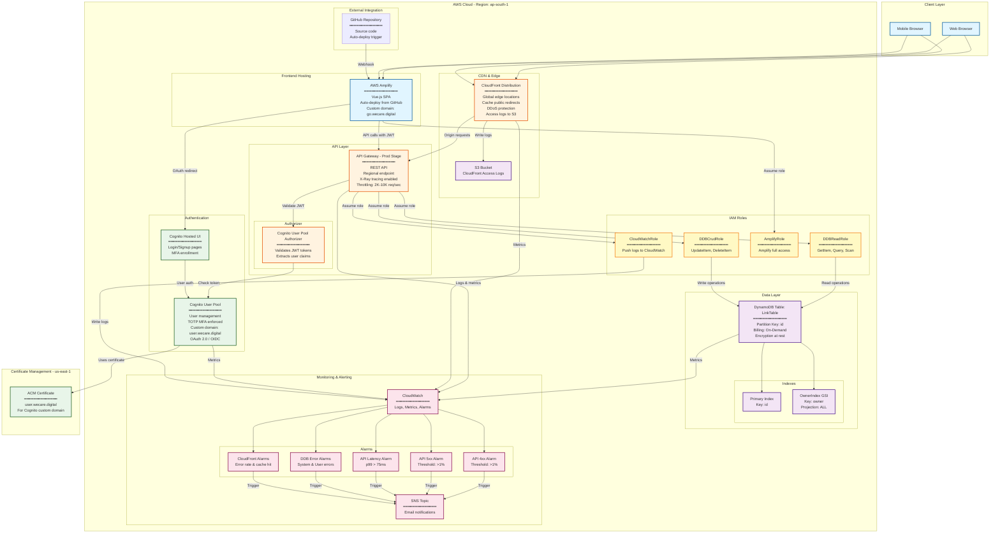
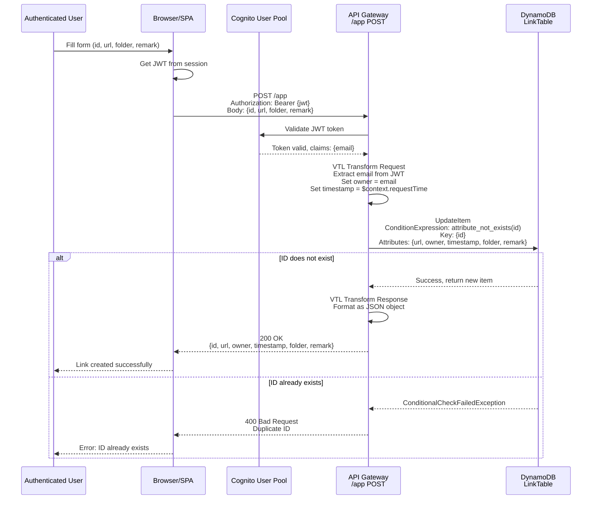
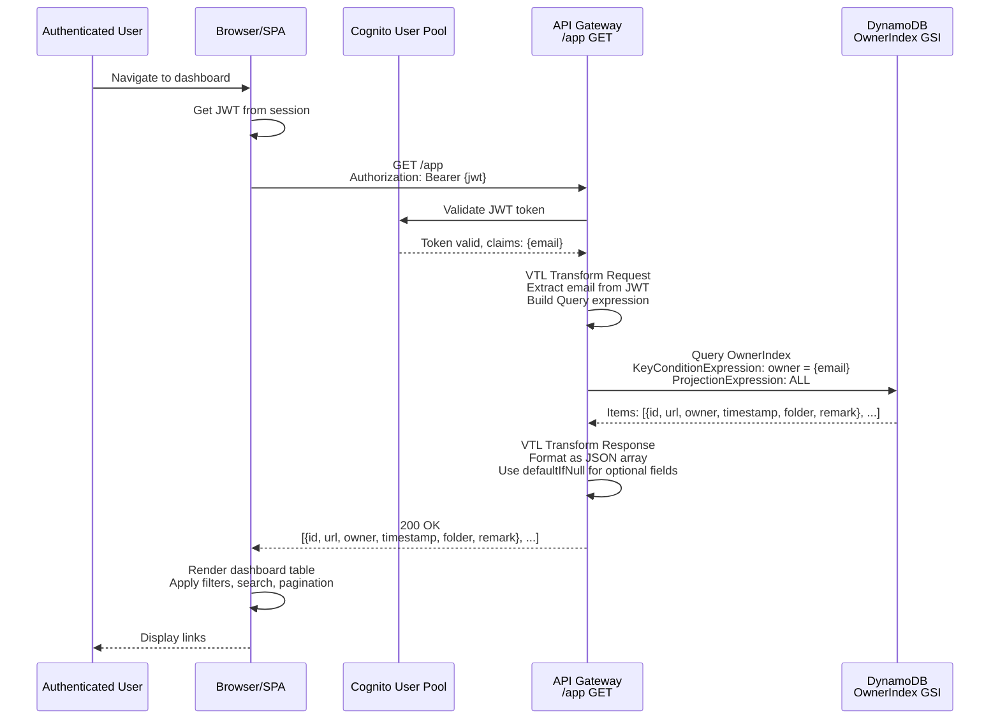
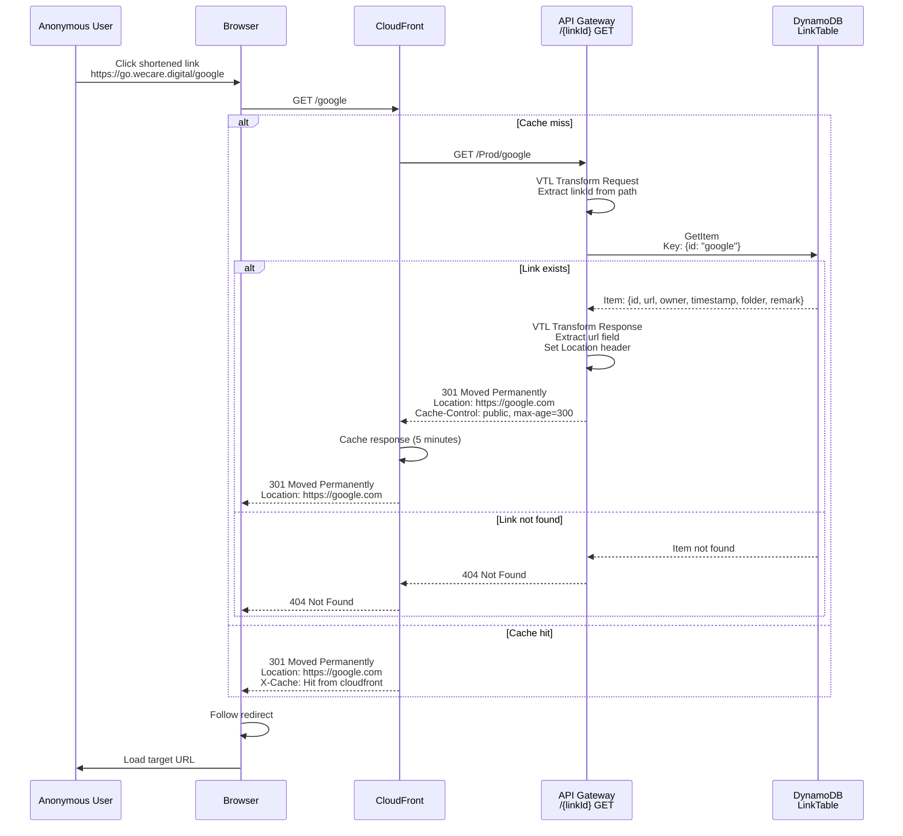
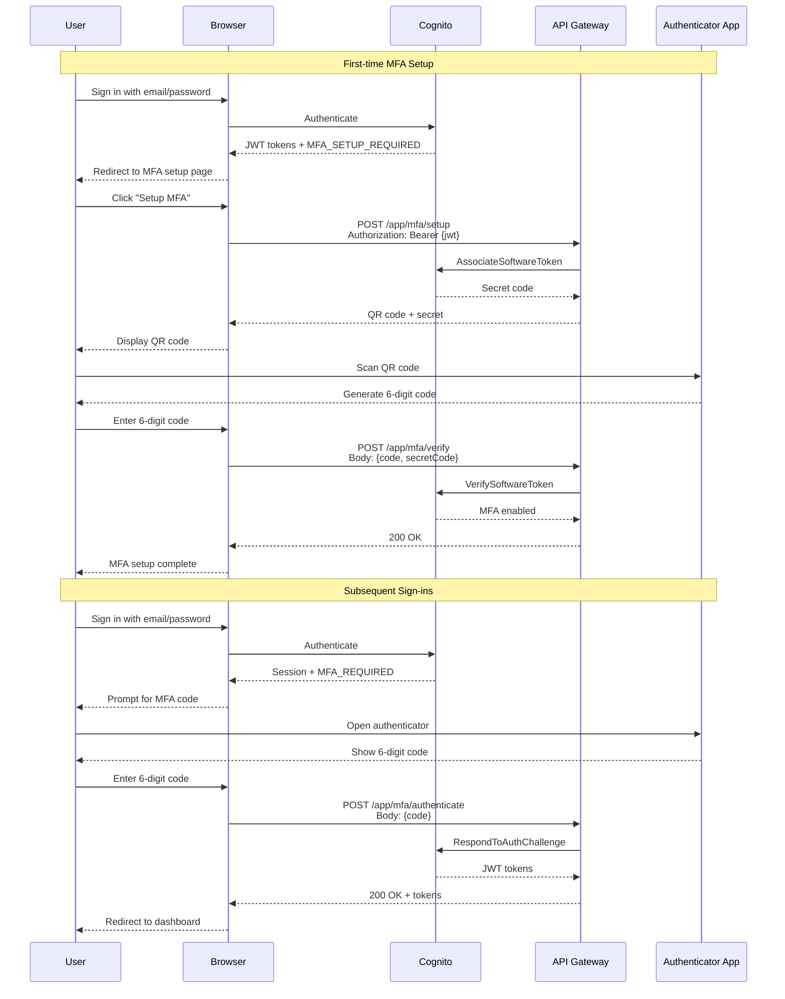
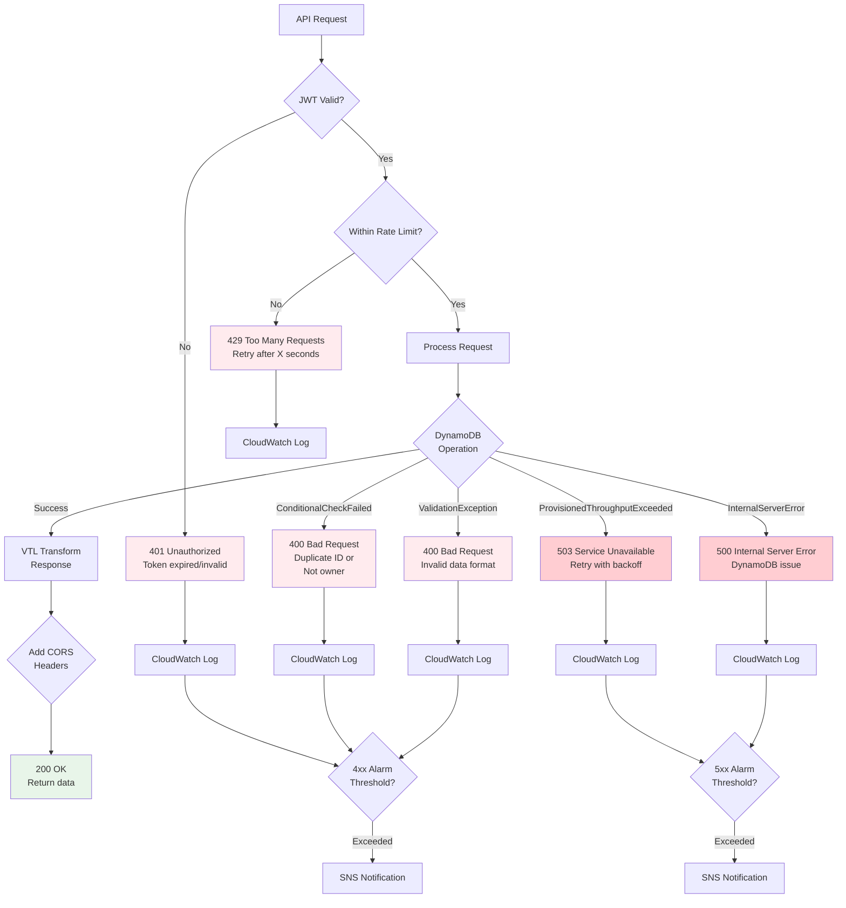

# URL Shortener Platform – Architecture

## Overview

The URL Shortener Platform is a serverless, production-grade link management system built entirely on AWS managed services. It provides:

- **Public URL redirection** – Anonymous users access shortened links that redirect to target URLs
- **Authenticated link management** – Dashboard users create, update, delete, and organize their links
- **Multi-factor authentication** – TOTP-based MFA for enhanced security
- **Serverless architecture** – Zero server management with automatic scaling

The platform consists of:
- **Frontend**: Vue.js SPA hosted on AWS Amplify
- **API**: AWS API Gateway with direct DynamoDB integrations (no Lambda functions)
- **Authentication**: Amazon Cognito User Pool with custom domain and MFA
- **Storage**: DynamoDB table with Global Secondary Index for owner-based queries
- **CDN**: CloudFront distribution for low-latency redirects
- **Monitoring**: CloudWatch alarms for API, DynamoDB, and CloudFront metrics

---

## System Context

```mermaid
graph TB
    subgraph "External Actors"
        AnonymousUser[Anonymous User<br/>Accesses shortened links]
        AuthUser[Authenticated User<br/>Manages links via dashboard]
    end
    
    subgraph "AWS Cloud - ap-south-1"
        subgraph "Frontend Layer"
            Amplify[AWS Amplify<br/>Vue.js SPA<br/>Dashboard UI]
        end
        
        subgraph "CDN Layer"
            CloudFront[CloudFront Distribution<br/>Global edge caching<br/>Low-latency redirects]
        end
        
        subgraph "API Layer"
            APIGateway[API Gateway - Prod Stage<br/>REST API<br/>Direct DynamoDB integrations]
            Cognito[Cognito User Pool<br/>JWT authentication<br/>TOTP MFA<br/>Custom domain: user.wecare.digital]
        end
        
        subgraph "Data Layer"
            DynamoDB[DynamoDB LinkTable<br/>Partition key: id<br/>GSI: OwnerIndex]
        end
        
        subgraph "Observability"
            CloudWatch[CloudWatch<br/>Logs, Metrics, Alarms]
            SNS[SNS Topic<br/>Alarm notifications]
        end
    end
    
    AnonymousUser -->|GET /{linkId}| CloudFront
    AuthUser -->|HTTPS| Amplify
    Amplify -->|API calls with JWT| APIGateway
    CloudFront -->|Origin requests| APIGateway
    APIGateway -->|Validate JWT| Cognito
    APIGateway -->|Query/UpdateItem/GetItem/DeleteItem| DynamoDB
    APIGateway -->|Logs| CloudWatch
    DynamoDB -->|Metrics| CloudWatch
    CloudFront -->|Metrics| CloudWatch
    CloudWatch -->|Trigger alarms| SNS
```

---

## Component Architecture

### High-Level Component Diagram



### Detailed Component Breakdown

#### API Gateway

**Deployment Details:**
- **Region**: `ap-south-1` (Mumbai)
- **Stage**: `Prod`
- **Base URL**: `https://xbj96ig388.execute-api.ap-south-1.amazonaws.com/Prod`
- **CloudFront URL**: `https://{distribution-id}.cloudfront.net` (cached)
- **API Definition**: OpenAPI 3.0.1 specification in `api.yaml`

**Key Resources:**

| Path | Methods | Auth | Purpose |
|------|---------|------|---------|
| `/{linkId}` | GET | None | Public redirect endpoint (301 with Location header) |
| `/` | GET | None | Root redirect to dashboard |
| `/app` | GET, POST, OPTIONS | Cognito | List user's links, create new link |
| `/app/{linkId}` | PUT, DELETE, OPTIONS | Cognito | Update or delete specific link |
| `/app/mfa/status` | GET, OPTIONS | Cognito | Check MFA enrollment status |
| `/app/mfa/setup` | POST, OPTIONS | Cognito | Initialize TOTP MFA setup |
| `/app/mfa/verify` | POST, OPTIONS | Cognito | Verify and enable TOTP MFA |
| `/app/mfa/authenticate` | POST, OPTIONS | Cognito | Authenticate with TOTP code |
| `/app/mfa/disable` | POST, OPTIONS | Cognito | Disable TOTP MFA |

**Integration Type**: Direct AWS service integrations
- No Lambda functions – API Gateway directly invokes DynamoDB actions
- VTL (Velocity Template Language) for request/response transformations
- IAM roles for DynamoDB access: `DDBReadRole` and `DDBCrudRole`

**Throttling Configuration:**
- Default endpoints: 2000 requests/sec, 1000 burst
- Public redirect `/{linkId}`: 10000 requests/sec, 4000 burst (higher for traffic spikes)

**CORS Configuration:**
- Enabled on all `/app` endpoints via OPTIONS methods
- Headers: `Access-Control-Allow-Origin: *`, `Access-Control-Allow-Headers`, `Access-Control-Allow-Methods`
- Max age: 86400 seconds (24 hours)

---

### DynamoDB

**Table Name**: `{AppName}-LinkTable-{UniqueId}` (e.g., `r-wecare-digital-LinkTable-YPF44B2N1ONI`)

**Billing Mode**: PAY_PER_REQUEST (on-demand scaling)

**Primary Key:**
- **Partition Key**: `id` (String) – The short link identifier (e.g., "google", "docs")

**Attributes:**
- `id` (S) – Short link ID (partition key)
- `url` (S) – Target URL (validated with regex pattern)
- `owner` (S) – User email from JWT token (e.g., "r@wecare.digital")
- `timestamp` (S) – Creation/update time from API Gateway request time
- `folder` (S) – Optional category/folder for organization
- `remark` (S) – Optional description/note

**Global Secondary Index:**
- **Index Name**: `OwnerIndex`
- **Partition Key**: `owner` (String)
- **Projection**: ALL (all attributes included)
- **Purpose**: Efficiently query all links owned by a specific user

**Access Patterns:**
1. **Get link by ID** (public redirect): `GetItem` on partition key `id`
2. **List user's links**: `Query` on `OwnerIndex` with `owner = {user-email}`
3. **Create/update link**: `UpdateItem` with `ConditionExpression: attribute_not_exists(id)` to prevent duplicates
4. **Delete link**: `DeleteItem` on partition key `id`

---

### Cognito User Pool

**User Pool Name**: `{AppName}-UserPool` (e.g., "shortener-UserPool")

**Authentication Configuration:**
- **Username Attributes**: Email (users sign in with email)
- **Auto-verified Attributes**: Email
- **Password Policy**: Minimum 8 characters
- **Custom Domain**: `user.wecare.digital` (managed login version 2)
- **Certificate**: ACM certificate in `us-east-1` for custom domain

**MFA Configuration:**
- **MFA Mode**: `ON` (enforced for all users)
- **Enabled MFA Types**: `SOFTWARE_TOKEN_MFA` (TOTP authenticator apps)
- **Flow**: Users must enroll in TOTP MFA after first sign-in

**User Pool Client:**
- **Client Name**: `{AppName}-UserPoolClient`
- **Generate Secret**: `false` (public client for SPA)
- **Supported Identity Providers**: `COGNITO`
- **OAuth Flows**: Authorization code grant
- **OAuth Scopes**: `email`, `openid`
- **Callback URLs**:
  - Amplify default domain: `https://master.{amplify-app-id}.amplifyapp.com`
  - Custom domain (if configured): `https://go.wecare.digital`
  - Local development (if enabled): `http://localhost:8080`
- **Logout URLs**: Same as callback URLs

**JWT Token Structure:**
- **Header**: `Authorization: Bearer {id_token}`
- **Claims Used**:
  - `email` – User's email address (used as `owner` in DynamoDB)
  - `sub` – User's unique ID
  - `cognito:username` – Username

**API Gateway Integration:**
- **Authorizer Type**: Cognito User Pool Authorizer
- **Token Source**: `Authorization` header
- **Token Validation**: API Gateway validates JWT signature and expiration
- **Context Variables**: `$context.authorizer.claims.email` used in VTL templates

---

### Frontend (Vue.js SPA)

**Hosting**: AWS Amplify

**Build Configuration:**
- **Source**: GitHub repository (auto-deploy on push to `master` branch)
- **Build Command**: `npm run build` (in `client/` directory)
- **Output Directory**: `client/dist`
- **Node Modules Cache**: Enabled

**Environment Variables** (configured via Amplify or `.env` file):
- `VUE_APP_NAME` – Application name
- `VUE_APP_CLIENT_ID` – Cognito User Pool Client ID
- `VUE_APP_API_ROOT` – CloudFront distribution URL
- `VUE_APP_AUTH_DOMAIN` – Cognito custom domain (`https://user.wecare.digital`)

**Key Features:**
- Dashboard for link management (list, create, update, delete)
- Folder-based organization and filtering
- Search functionality
- Pagination
- MFA enrollment and management UI
- Responsive design with Tailwind CSS

**Deployment Domains:**
- **Default**: `https://master.{amplify-app-id}.amplifyapp.com`
- **Custom** (optional): `https://go.wecare.digital`

---

### CloudFront Distribution

**Purpose**: Global CDN for low-latency link redirects

**Origin**: API Gateway (`{api-id}.execute-api.ap-south-1.amazonaws.com`)
- **Origin Path**: `/Prod`
- **Origin Protocol**: HTTPS only

**Cache Behavior:**
- **Allowed Methods**: All HTTP methods (GET, POST, PUT, DELETE, OPTIONS, HEAD, PATCH)
- **Cached Methods**: GET, HEAD, OPTIONS
- **Compress**: Enabled (gzip/brotli)
- **Default TTL**: 0 seconds (no caching for dynamic API responses)
- **Forwarded Headers**: `Authorization`, `Access-Control-Request-Headers`, `Access-Control-Request-Method`, `Origin`
- **Query Strings**: Not forwarded
- **Viewer Protocol Policy**: Redirect HTTP to HTTPS

**Custom Error Responses:**
- 400 errors: 0 second cache
- 403 errors: 1 second cache
- 500 errors: 5 second cache

**Access Logs**: Stored in S3 bucket (`CloudFrontAccessLogsBucket`)

---

## Request Flows with Diagrams

### Flow 1: Creating a Short Link



**Key Security Features:**
- `owner` field is **always** set from JWT email claim (cannot be spoofed by client)
- `timestamp` is **always** set from API Gateway request time (consistent, tamper-proof)
- `ConditionExpression` prevents duplicate IDs (atomic check-and-set)

---

### Flow 2: Listing User's Links



**Key Features:**
- Uses `OwnerIndex` GSI for efficient queries (no table scan)
- Returns **only** links owned by the authenticated user (data isolation)
- `defaultIfNull` in VTL ensures optional fields (folder, remark) return empty strings instead of null

---

### Flow 3: Public Redirect



**Performance Optimizations:**
- CloudFront edge caching reduces latency for popular links
- DynamoDB single-digit millisecond GetItem latency
- 301 status code allows browser caching
- High throttling limits (10000 req/sec) for traffic spikes

---

## Data Model

### Link Entity

```json
{
  "id": "google",
  "url": "https://google.com",
  "owner": "r@wecare.digital",
  "timestamp": "08/Dec/2025:15:30:45 +0000",
  "folder": "search",
  "remark": "Google search engine"
}
```

**Field Specifications:**

| Field | Type | Required | Source | Validation | Purpose |
|-------|------|----------|--------|------------|---------|
| `id` | String | Yes | User input | Alphanumeric, unique | Short link identifier (partition key) |
| `url` | String | Yes | User input | Regex: `^https?://[-a-zA-Z0-9@:%._\+~#=]{2,256}\.[a-z]{2,9}\b([-a-zA-Z0-9@:%_\+.~#?&//=]*)` | Target URL for redirect |
| `owner` | String | Yes | JWT email claim | Email format | User who created the link (GSI partition key) |
| `timestamp` | String | Yes | API Gateway `$context.requestTime` | ISO 8601 format | Creation/update time |
| `folder` | String | No | User input | Max 255 chars | Category/folder for organization |
| `remark` | String | No | User input | Max 1000 chars | Description/note |

**Indexes:**

1. **Primary Index**:
   - Partition Key: `id`
   - Use Case: Get link by ID (public redirect)
   - Access Pattern: `GetItem(id="google")`

2. **OwnerIndex (GSI)**:
   - Partition Key: `owner`
   - Use Case: List all links for a user
   - Access Pattern: `Query(owner="r@wecare.digital")`

**Data Isolation:**
- Each user sees only their own links (enforced by `OwnerIndex` query with JWT email)
- No cross-user data leakage
- Owner field cannot be spoofed (set server-side from JWT)

---

## Non-functional Aspects

### Reliability

**Service SLAs:**
- **API Gateway**: 99.95% uptime SLA
- **DynamoDB**: 99.99% uptime SLA (single-region), 99.999% (global tables)
- **Cognito**: 99.9% uptime SLA
- **CloudFront**: 99.9% uptime SLA
- **Amplify**: 99.95% uptime SLA

**Fault Tolerance:**
- No single points of failure (all managed services with built-in redundancy)
- DynamoDB automatic replication across 3 Availability Zones
- API Gateway automatic failover
- CloudFront global edge network (200+ locations)

**Error Handling:**
- CloudWatch alarms for 4xx/5xx errors (threshold: 1% average over 1 minute)
- SNS notifications for alarm triggers
- Custom error responses in CloudFront (0-5 second cache based on error type)

---

### Scalability

**Serverless Auto-Scaling:**
- **API Gateway**: Handles 10,000 requests/second per account (soft limit, can be increased)
- **DynamoDB**: On-demand billing mode scales automatically to handle traffic
- **Cognito**: Scales to millions of users
- **CloudFront**: Unlimited requests (global edge network)
- **Amplify**: Auto-scales hosting based on traffic

**Cost Efficiency:**
- Pay-per-request pricing (no idle costs)
- No servers to provision or manage
- CloudFront caching reduces API Gateway/DynamoDB requests

**Throttling Protection:**
- API Gateway throttling limits prevent DDoS attacks
- Per-method throttling for fine-grained control
- Burst capacity for traffic spikes

---

### Security

**Authentication & Authorization:**
- Cognito User Pool with JWT tokens (1-hour expiration)
- TOTP MFA enforced for all users (software token)
- Custom domain with ACM certificate (TLS 1.2+)
- API Gateway validates JWT signature and expiration

**Data Security:**
- All data encrypted at rest (DynamoDB default encryption)
- All data encrypted in transit (HTTPS/TLS)
- IAM roles with least-privilege permissions
- No hardcoded credentials (IAM role-based access)

**Network Security:**
- API Gateway regional endpoint (not public internet-facing)
- CloudFront as single entry point (DDoS protection)
- CORS configured for specific origins
- No direct DynamoDB access from internet

**Audit & Compliance:**
- CloudWatch Logs for all API requests (request/response bodies)
- CloudTrail for AWS API calls
- S3 access logs for CloudFront
- Retention: 30 days (configurable)

**Potential Threats & Mitigations:**

| Threat | Mitigation |
|--------|------------|
| Brute-force attacks | Cognito account lockout, MFA enforcement |
| Token theft | Short token expiration (1 hour), HTTPS only |
| DDoS attacks | CloudFront + API Gateway throttling |
| SQL injection | No SQL (DynamoDB NoSQL), parameterized queries |
| XSS attacks | Vue.js automatic escaping, CSP headers |
| CSRF attacks | SameSite cookies, CORS validation |
| Duplicate link IDs | DynamoDB ConditionExpression (atomic check) |
| Owner spoofing | Owner set server-side from JWT (not from request body) |

---

### Observability

**CloudWatch Logs:**
- **API Gateway Execution Logs**: Request/response bodies, latency, errors
- **API Gateway Access Logs**: Client IP, user agent, request time
- **Log Retention**: 30 days (configurable)
- **Log Groups**:
  - `/aws/apigateway/{api-id}/Prod`
  - `/aws/amplify/{app-id}`

**CloudWatch Metrics:**
- **API Gateway**: Count, 4XXError, 5XXError, Latency, IntegrationLatency
- **DynamoDB**: UserErrors, SystemErrors, ConsumedReadCapacityUnits, ConsumedWriteCapacityUnits
- **CloudFront**: Requests, BytesDownloaded, TotalErrorRate, CacheHitRate
- **Cognito**: SignInSuccesses, SignInThrottles, TokenRefreshSuccesses

**CloudWatch Alarms:**

| Alarm | Metric | Threshold | Action |
|-------|--------|-----------|--------|
| API 4xx Errors | 4XXError | > 1% average over 1 min | SNS notification |
| API 5xx Errors | 5XXError | > 1% average over 1 min | SNS notification |
| API Latency | Latency (p99) | > 75ms over 5 min | SNS notification |
| DynamoDB System Errors | SystemErrors | > 1% average over 1 min | SNS notification |
| DynamoDB User Errors | UserErrors | > 10% average over 1 min | SNS notification |
| CloudFront Errors | TotalErrorRate | >= 5 errors over 1 min | SNS notification |
| CloudFront Cache Hit Rate | CacheHitRate | <= 80% over 5 min | SNS notification |

**X-Ray Tracing:**
- Enabled on API Gateway (trace requests end-to-end)
- Service map visualization
- Latency analysis by component

**Dashboards:**
- Custom CloudWatch dashboard (recommended to create):
  - API Gateway request count, latency, errors
  - DynamoDB read/write capacity, throttles
  - CloudFront cache hit rate, error rate
  - Cognito sign-in metrics

---

## Related Attachments

**Infrastructure as Code:**
- `template.yaml` – AWS SAM template (CloudFormation)
- Defines all resources: API Gateway, DynamoDB, Cognito, Amplify, CloudFront, IAM roles, CloudWatch alarms

**API Specification:**
- `api.yaml` – OpenAPI 3.0.1 specification
- Defines all endpoints, request/response schemas, security schemes
- Includes VTL templates for DynamoDB integrations (embedded in SAM template)

**Frontend Code:**
- `client/` – Vue.js SPA source code
- `client/src/views/Dashboard.vue` – Main dashboard component
- `client/src/views/Login.vue` – Authentication UI
- `client/src/store/` – Vuex state management

**Deployment Scripts:**
- `update-api-gateway.ps1` – PowerShell script for manual API Gateway updates
- Amplify build spec embedded in `template.yaml`

**Additional Documentation:**
- `docs/02-deployment.md` – Deployment guide
- `docs/03-configuration.md` – Configuration reference
- `docs/04-development.md` – Development guide

**Diagrams:**
- All diagrams in this document are Mermaid-based (render in GitHub, VS Code, or Mermaid Live Editor)
- Export to PNG/SVG: Use Mermaid CLI or online tools

---

## Architecture Decision Records (ADRs)

### ADR-001: Direct DynamoDB Integration (No Lambda)

**Decision**: Use API Gateway direct integrations with DynamoDB instead of Lambda functions.

**Rationale**:
- Reduces latency (no Lambda cold starts)
- Reduces cost (no Lambda invocations)
- Simplifies architecture (fewer moving parts)
- VTL templates provide sufficient transformation logic

**Trade-offs**:
- VTL is less flexible than code (limited to simple transformations)
- Harder to debug than Lambda (no breakpoints)
- Complex business logic would require Lambda

**Status**: Accepted

---

### ADR-002: On-Demand DynamoDB Billing

**Decision**: Use PAY_PER_REQUEST billing mode instead of provisioned capacity.

**Rationale**:
- Unpredictable traffic patterns (viral links can cause spikes)
- No capacity planning required
- Cost-effective for low-to-medium traffic
- Automatic scaling

**Trade-offs**:
- Higher per-request cost than provisioned capacity at high scale
- No reserved capacity discounts

**Status**: Accepted

---

### ADR-003: CloudFront for Public Redirects

**Decision**: Use CloudFront in front of API Gateway for public redirect endpoint.

**Rationale**:
- Global edge caching reduces latency
- DDoS protection
- Reduces API Gateway/DynamoDB costs for popular links
- Better user experience (faster redirects)

**Trade-offs**:
- Adds complexity (cache invalidation)
- Slightly higher cost for low-traffic links
- Cache misses still hit API Gateway

**Status**: Accepted

---

### ADR-004: Enforced TOTP MFA

**Decision**: Enforce TOTP MFA for all users (MfaConfiguration: ON).

**Rationale**:
- Enhanced security (protects against password theft)
- Compliance requirements
- Industry best practice for sensitive operations

**Trade-offs**:
- Slightly worse user experience (extra step during sign-in)
- Users must have authenticator app
- Support burden for MFA issues

**Status**: Accepted

---

## MFA Authentication Flow

### TOTP MFA Enrollment and Authentication



---

## Error Handling and Recovery

### Error Flow Diagram



### Common Error Scenarios and Solutions

| Error Code | Scenario | Root Cause | Solution | Prevention |
|------------|----------|------------|----------|------------|
| 401 | Token expired | JWT expired (1 hour) | Sign out and sign in again | Implement token refresh |
| 400 | Duplicate ID | Link ID already exists | Choose different ID | Check existence before submit |
| 400 | Not owner | User trying to modify others' link | Verify ownership | Frontend validation |
| 403 | CORS error | Missing CORS headers | Verify OPTIONS method configured | Test CORS in dev |
| 429 | Rate limit | Too many requests | Implement exponential backoff | Add client-side throttling |
| 500 | DynamoDB error | Service issue | Retry with backoff | Monitor DynamoDB metrics |
| 503 | Throttling | DynamoDB capacity exceeded | Retry with backoff | Switch to on-demand billing |

---

## Performance Metrics and Benchmarks

### Expected Latency (p50/p95/p99)

| Operation | p50 | p95 | p99 | Notes |
|-----------|-----|-----|-----|-------|
| Public redirect (cache hit) | 10ms | 20ms | 30ms | CloudFront edge response |
| Public redirect (cache miss) | 50ms | 100ms | 150ms | API Gateway + DynamoDB |
| List links (10 items) | 40ms | 80ms | 120ms | DynamoDB Query on GSI |
| Create link | 45ms | 90ms | 130ms | DynamoDB UpdateItem |
| Update link | 45ms | 90ms | 130ms | DynamoDB UpdateItem |
| Delete link | 40ms | 80ms | 120ms | DynamoDB DeleteItem |
| MFA setup | 200ms | 400ms | 600ms | Cognito API calls |

### Throughput Capacity

| Component | Reads/sec | Writes/sec | Notes |
|-----------|-----------|------------|-------|
| API Gateway | 10,000 | 10,000 | Per account, can be increased |
| DynamoDB (on-demand) | Unlimited | Unlimited | Auto-scales, double previous peak |
| CloudFront | Unlimited | N/A | Global edge network |
| Cognito | 1,000 | 1,000 | Per user pool, can be increased |

### Cost per 1,000 Requests

| Operation | API Gateway | DynamoDB | CloudFront | Total |
|-----------|-------------|----------|------------|-------|
| Public redirect (cached) | $0.00 | $0.00 | $0.01 | $0.01 |
| Public redirect (uncached) | $0.0035 | $0.0025 | $0.01 | $0.016 |
| List links | $0.0035 | $0.0025 | $0.00 | $0.006 |
| Create link | $0.0035 | $0.0125 | $0.00 | $0.016 |
| Update link | $0.0035 | $0.0125 | $0.00 | $0.016 |
| Delete link | $0.0035 | $0.0125 | $0.00 | $0.016 |

---

## Real-World Use Cases

### Use Case 1: Marketing Campaign

**Scenario**: Company launches product campaign with 50 short links for different channels (email, social media, ads).

**Implementation**:
- Create folder: "campaign-2025-q1"
- Create 50 links with descriptive IDs: "fb-ad-1", "email-newsletter", "twitter-post-1"
- Add remarks: "Facebook ad targeting developers", "Weekly newsletter Dec 9"
- Share links across channels

**Benefits**:
- Organized link management (filter by folder)
- Easy to identify link purpose (ID + remark)
- Track which links are used (via CloudWatch logs)
- Update target URLs without changing short links

**Metrics**:
- 50 links created in ~5 minutes
- 10,000 clicks/day across all links
- Cost: ~$0.16/day ($4.80/month)

---

### Use Case 2: Documentation Portal

**Scenario**: Developer team maintains 200+ documentation links that frequently change.

**Implementation**:
- Create folders: "api-docs", "guides", "tutorials", "changelog"
- Use semantic IDs: "api-auth", "guide-quickstart", "tutorial-deploy"
- Add remarks with version info: "API v2.0 authentication guide"
- Update URLs when docs are reorganized (no broken links)

**Benefits**:
- Stable short links even when docs move
- Easy to remember IDs (go.company.com/api-auth)
- Folder-based organization
- Search by keyword in remarks

**Metrics**:
- 200 links managed by 5 team members
- 1,000 clicks/day
- Cost: ~$0.02/day ($0.60/month)

---

### Use Case 3: Event Registration

**Scenario**: Conference with 20 events, each needs registration link.

**Implementation**:
- Create folder: "conference-2025"
- Create links: "keynote", "workshop-aws", "networking-lunch"
- Add remarks: "Keynote by John Doe, Dec 15 10am"
- Set expiration (manual deletion after event)

**Benefits**:
- Clean, memorable URLs for attendees
- Easy to update if event details change
- Centralized management
- Can disable links after event ends

**Metrics**:
- 20 links for 2-day conference
- 5,000 registrations total
- Cost: ~$0.08 for entire event

---

## Capacity Planning

### Traffic Patterns

**Typical Daily Pattern**:
```
00:00-06:00: 100 req/hour   (low activity)
06:00-09:00: 500 req/hour   (morning peak)
09:00-12:00: 1000 req/hour  (business hours)
12:00-14:00: 800 req/hour   (lunch dip)
14:00-18:00: 1200 req/hour  (afternoon peak)
18:00-24:00: 400 req/hour   (evening decline)
```

**Viral Link Scenario**:
- Normal: 1,000 requests/hour
- Viral spike: 50,000 requests/hour (50x increase)
- Duration: 2-4 hours
- Auto-scaling: DynamoDB and API Gateway handle automatically
- Cost impact: ~$2-3 for spike duration

### Scaling Thresholds

| Metric | Current | Warning | Critical | Action |
|--------|---------|---------|----------|--------|
| API Gateway requests/sec | 100 | 5,000 | 8,000 | Request limit increase |
| DynamoDB read capacity | Auto | N/A | N/A | On-demand scales automatically |
| DynamoDB write capacity | Auto | N/A | N/A | On-demand scales automatically |
| CloudFront requests/sec | 1,000 | N/A | N/A | Unlimited capacity |
| 4xx error rate | 0.1% | 1% | 5% | Investigate client issues |
| 5xx error rate | 0.01% | 0.1% | 1% | Investigate service issues |
| API latency (p99) | 50ms | 75ms | 150ms | Optimize queries |

---

## Security Hardening Checklist

### Production Deployment Security

- [ ] **Cognito**: MFA enforced for all users
- [ ] **Cognito**: Password policy meets requirements (min 8 chars)
- [ ] **Cognito**: Account lockout enabled (5 failed attempts)
- [ ] **API Gateway**: CORS restricted to specific domains (not `*`)
- [ ] **API Gateway**: API keys enabled for programmatic access (optional)
- [ ] **API Gateway**: Request validation enabled
- [ ] **DynamoDB**: Point-in-time recovery enabled
- [ ] **DynamoDB**: Encryption at rest enabled (default)
- [ ] **CloudFront**: HTTPS only (redirect HTTP to HTTPS)
- [ ] **CloudFront**: Custom SSL certificate (not default)
- [ ] **IAM**: Roles follow least-privilege principle
- [ ] **IAM**: No hardcoded credentials in code
- [ ] **CloudWatch**: Log retention set (30 days recommended)
- [ ] **CloudWatch**: Alarms configured and tested
- [ ] **CloudTrail**: Enabled for audit logging
- [ ] **SNS**: Email subscriptions confirmed
- [ ] **Amplify**: Environment variables not exposed in client
- [ ] **GitHub**: Personal access token rotated regularly
- [ ] **ACM**: Certificate auto-renewal enabled

### Compliance Considerations

**GDPR (if applicable)**:
- User data (email) stored in DynamoDB
- Right to erasure: Delete user's links and account
- Data portability: Export user's links as JSON/CSV
- Consent: Terms of service acceptance required

**SOC 2 (if applicable)**:
- CloudWatch logs for audit trail
- CloudTrail for AWS API calls
- MFA enforcement for access control
- Encryption at rest and in transit

---

## Disaster Recovery

### Backup Strategy

**DynamoDB**:
- **Point-in-Time Recovery**: Enabled (restore to any point in last 35 days)
- **On-Demand Backups**: Manual backups before major changes
- **Backup Frequency**: Automatic continuous backups
- **Retention**: 35 days (PITR), indefinite (on-demand)

**Cognito**:
- **User Pool Export**: Use AWS CLI to export users
- **Backup Frequency**: Weekly (automated script)
- **Retention**: 90 days

**Amplify**:
- **Source Control**: GitHub repository (primary backup)
- **Build Artifacts**: Stored in Amplify (last 10 builds)

### Recovery Procedures

**Scenario 1: Accidental Link Deletion**
1. Check DynamoDB point-in-time recovery
2. Restore table to point before deletion
3. Export deleted link data
4. Re-import to current table

**Scenario 2: DynamoDB Table Corruption**
1. Create new table from latest backup
2. Update API Gateway integration to point to new table
3. Verify data integrity
4. Update CloudFormation stack

**Scenario 3: Complete Region Failure**
1. Deploy stack to different region (e.g., us-east-1)
2. Restore DynamoDB from backup
3. Update DNS to point to new region
4. Verify all services operational

**Recovery Time Objective (RTO)**: 4 hours  
**Recovery Point Objective (RPO)**: 5 minutes (PITR)

---

## Future Enhancements

**Potential Improvements:**
1. **Custom Short Domains**: Support user-provided custom domains (e.g., `short.company.com`)
2. **Link Analytics**: Track click counts, referrers, geographic distribution
3. **Link Expiration**: Auto-expire links after a specified date
4. **QR Code Generation**: Generate QR codes for shortened links
5. **Bulk Import/Export**: CSV import/export for link management
6. **Team Collaboration**: Share links across team members
7. **Link Preview**: Show target URL preview before redirect
8. **Rate Limiting per User**: Prevent abuse by limiting links per user
9. **Link Validation**: Check target URL accessibility before creating link
10. **API Keys**: Programmatic API access for automation

**Scalability Enhancements:**
1. **DynamoDB Global Tables**: Multi-region replication for global users
2. **API Gateway Edge-Optimized**: Deploy API to CloudFront edge locations
3. **ElastiCache**: Cache frequently accessed links in Redis
4. **Lambda@Edge**: Run redirect logic at CloudFront edge (eliminate origin requests)

---

## Glossary

- **API Gateway**: AWS managed service for creating REST APIs
- **Amplify**: AWS managed service for hosting static websites and SPAs
- **CloudFront**: AWS global CDN (Content Delivery Network)
- **Cognito**: AWS managed authentication and user management service
- **DynamoDB**: AWS managed NoSQL database
- **GSI**: Global Secondary Index (alternate query pattern in DynamoDB)
- **JWT**: JSON Web Token (authentication token format)
- **MFA**: Multi-Factor Authentication
- **SAM**: Serverless Application Model (CloudFormation extension)
- **SPA**: Single-Page Application
- **TOTP**: Time-based One-Time Password (MFA method)
- **VTL**: Velocity Template Language (used in API Gateway for transformations)

---

**Document Version**: 1.0  
**Last Updated**: December 9, 2025  
**Maintained By**: DevOps Team
