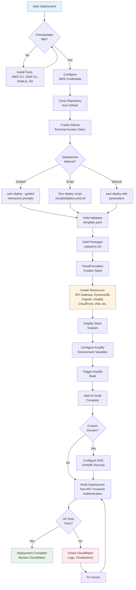

# URL Shortener Platform – Deployment Guide

## Overview

This guide provides step-by-step instructions for deploying the URL Shortener Platform to AWS. The deployment uses AWS SAM (Serverless Application Model) to provision all infrastructure resources.

**Deployment Time**: ~15-20 minutes (first deployment)  
**Prerequisites**: AWS CLI, SAM CLI, GitHub account, Node.js 14+

---

## Deployment Flow Overview



---

## Environments

The platform supports multiple deployment environments:

| Environment | Stage | Region | Purpose |
|-------------|-------|--------|---------|
| Production | `Prod` | `ap-south-1` | Live production environment |
| Staging | `Stage` | `ap-south-1` | Pre-production testing (optional) |
| Development | `Dev` | `ap-south-1` | Development testing (optional) |

**Current Deployment:**
- **API Gateway URL**: `https://xbj96ig388.execute-api.ap-south-1.amazonaws.com/Prod`
- **CloudFront URL**: `https://{distribution-id}.cloudfront.net`
- **Custom Domain**: `https://go.wecare.digital` (frontend), `https://user.wecare.digital` (auth)
- **Region**: `ap-south-1` (Mumbai)

---

## Prerequisites

### 1. Install Required Tools

**AWS CLI:**
```bash
# Windows (PowerShell)
msiexec.exe /i https://awscli.amazonaws.com/AWSCLIV2.msi

# Verify installation
aws --version
```

**AWS SAM CLI:**
```bash
# Windows (PowerShell)
choco install aws-sam-cli

# Verify installation
sam --version
```

**Node.js 14+ and npm:**
```bash
# Download from https://nodejs.org/
# Verify installation
node --version
npm --version
```

**Git:**
```bash
# Download from https://git-scm.com/
# Verify installation
git --version
```

---

### 2. Configure AWS Credentials

```bash
# Configure AWS CLI with your credentials
aws configure

# Enter your credentials:
# AWS Access Key ID: [your-access-key]
# AWS Secret Access Key: [your-secret-key]
# Default region name: ap-south-1
# Default output format: json

# Verify configuration
aws sts get-caller-identity
```

**Required IAM Permissions:**
- CloudFormation: Full access
- API Gateway: Full access
- DynamoDB: Full access
- Cognito: Full access
- Amplify: Full access
- CloudFront: Full access
- S3: Full access (for SAM deployment artifacts)
- IAM: Create/update roles and policies
- CloudWatch: Create/update alarms and log groups
- SNS: Create/update topics

---

### 3. Fork and Clone Repository

```bash
# Fork the repository on GitHub
# Then clone your fork
git clone https://github.com/YOUR-USERNAME/r.wecare.digital.git
cd r.wecare.digital
```

---

### 4. Create GitHub Personal Access Token

1. Go to GitHub Settings → Developer settings → Personal access tokens → Tokens (classic)
2. Click "Generate new token (classic)"
3. Select scopes:
   - `repo` (Full control of private repositories)
   - `admin:repo_hook` (Full control of repository hooks)
4. Generate token and **save it securely** (you'll need it for deployment)

---

## One-Command Deployment

### Option 1: Guided Deployment (Recommended for First Time)

```bash
# Deploy with interactive prompts
sam deploy --guided

# You will be prompted for:
# - Stack Name: url-shortener-prod
# - AWS Region: ap-south-1
# - Parameter AppName: shortener
# - Parameter CustomDomainName: user.wecare.digital
# - Parameter UseLocalClient: false
# - Parameter GithubRepository: https://github.com/YOUR-USERNAME/r.wecare.digital
# - Parameter PersonalAccessToken: [your-github-token]
# - Parameter CustomDomain: https://go.wecare.digital
# - Confirm changes before deploy: Y
# - Allow SAM CLI IAM role creation: Y
# - Save arguments to configuration file: Y
```

**What happens during deployment:**
1. SAM validates `template.yaml`
2. SAM packages application (uploads to S3)
3. CloudFormation creates/updates stack resources:
   - API Gateway
   - DynamoDB table with OwnerIndex GSI
   - Cognito User Pool with custom domain
   - Amplify app connected to GitHub
   - CloudFront distribution
   - IAM roles
   - CloudWatch alarms
   - SNS topic
4. Outputs are displayed (API URL, Amplify URL, etc.)

---

### Option 2: Non-Interactive Deployment

```bash
# Deploy with parameters file
sam deploy \
  --stack-name url-shortener-prod \
  --region ap-south-1 \
  --parameter-overrides \
    AppName=shortener \
    CustomDomainName=user.wecare.digital \
    UseLocalClient=false \
    GithubRepository=https://github.com/YOUR-USERNAME/r.wecare.digital \
    PersonalAccessToken=YOUR_GITHUB_TOKEN \
    CustomDomain=https://go.wecare.digital \
  --capabilities CAPABILITY_IAM \
  --no-confirm-changeset
```

---

### Option 3: Using Deployment Script

Create `scripts/deploy-prod.sh`:

```bash
#!/bin/bash
set -e

echo "🚀 Deploying URL Shortener Platform to Production..."

# Build frontend
echo "📦 Building frontend..."
cd client
npm ci
npm run build
cd ..

# Deploy SAM stack
echo "☁️  Deploying infrastructure..."
sam deploy \
  --stack-name url-shortener-prod \
  --region ap-south-1 \
  --parameter-overrides \
    AppName=shortener \
    CustomDomainName=user.wecare.digital \
    UseLocalClient=false \
    GithubRepository=https://github.com/YOUR-USERNAME/r.wecare.digital \
    PersonalAccessToken=$GITHUB_TOKEN \
    CustomDomain=https://go.wecare.digital \
  --capabilities CAPABILITY_IAM \
  --no-confirm-changeset

# Get stack outputs
echo "📋 Retrieving stack outputs..."
AMPLIFY_APP_ID=$(aws cloudformation describe-stacks \
  --stack-name url-shortener-prod \
  --region ap-south-1 \
  --query 'Stacks[0].Outputs[?OutputKey==`AmplifyAppId`].OutputValue' \
  --output text)

API_ROOT=$(aws cloudformation describe-stacks \
  --stack-name url-shortener-prod \
  --region ap-south-1 \
  --query 'Stacks[0].Outputs[?OutputKey==`VueAppAPIRoot`].OutputValue' \
  --output text)

CLIENT_ID=$(aws cloudformation describe-stacks \
  --stack-name url-shortener-prod \
  --region ap-south-1 \
  --query 'Stacks[0].Outputs[?OutputKey==`VueAppClientId`].OutputValue' \
  --output text)

AUTH_DOMAIN=$(aws cloudformation describe-stacks \
  --stack-name url-shortener-prod \
  --region ap-south-1 \
  --query 'Stacks[0].Outputs[?OutputKey==`VueAppAuthDomain`].OutputValue' \
  --output text)

# Configure Amplify environment variables
echo "⚙️  Configuring Amplify environment variables..."
aws amplify update-app \
  --app-id $AMPLIFY_APP_ID \
  --region ap-south-1 \
  --environment-variables \
    VUE_APP_NAME=shortener,\
    VUE_APP_CLIENT_ID=$CLIENT_ID,\
    VUE_APP_API_ROOT=$API_ROOT,\
    VUE_APP_AUTH_DOMAIN=$AUTH_DOMAIN

# Trigger Amplify build
echo "🔨 Triggering Amplify build..."
aws amplify start-job \
  --app-id $AMPLIFY_APP_ID \
  --branch-name master \
  --job-type RELEASE \
  --region ap-south-1

echo "✅ Deployment complete!"
echo ""
echo "📊 Stack Outputs:"
echo "  API Gateway URL: $API_ROOT"
echo "  Cognito Auth Domain: $AUTH_DOMAIN"
echo "  Cognito Client ID: $CLIENT_ID"
echo "  Amplify App ID: $AMPLIFY_APP_ID"
echo ""
echo "🌐 Frontend will be available at:"
echo "  https://master.$AMPLIFY_APP_ID.amplifyapp.com"
echo "  (or your custom domain after DNS configuration)"
echo ""
echo "⏳ Amplify build in progress. Check status:"
echo "  aws amplify list-jobs --app-id $AMPLIFY_APP_ID --branch-name master --region ap-south-1"
```

**Run the script:**
```bash
# Set GitHub token as environment variable
export GITHUB_TOKEN=your_github_token_here

# Make script executable
chmod +x scripts/deploy-prod.sh

# Run deployment
./scripts/deploy-prod.sh
```

---

## Post-Deployment Configuration

### 1. Configure Amplify Environment Variables

After stack deployment, configure Amplify with environment variables:

```bash
# Get stack outputs
AMPLIFY_APP_ID=$(aws cloudformation describe-stacks \
  --stack-name url-shortener-prod \
  --region ap-south-1 \
  --query 'Stacks[0].Outputs[?OutputKey==`AmplifyAppId`].OutputValue' \
  --output text)

# Run the Amplify update command from stack outputs
aws amplify update-app \
  --app-id $AMPLIFY_APP_ID \
  --region ap-south-1 \
  --environment-variables \
    VUE_APP_NAME=shortener,\
    VUE_APP_CLIENT_ID={from-stack-outputs},\
    VUE_APP_API_ROOT={from-stack-outputs},\
    VUE_APP_AUTH_DOMAIN={from-stack-outputs}
```

**Or use the command from stack outputs:**
```bash
# Copy the AmplifyEnvironmentUpdateCommand output and run it
aws cloudformation describe-stacks \
  --stack-name url-shortener-prod \
  --region ap-south-1 \
  --query 'Stacks[0].Outputs[?OutputKey==`AmplifyEnvironmentUpdateCommand`].OutputValue' \
  --output text
```

---

### 2. Trigger Amplify Build

```bash
# Trigger initial build
aws amplify start-job \
  --app-id $AMPLIFY_APP_ID \
  --branch-name master \
  --job-type RELEASE \
  --region ap-south-1

# Check build status
aws amplify list-jobs \
  --app-id $AMPLIFY_APP_ID \
  --branch-name master \
  --region ap-south-1 \
  --max-results 1
```

**Or use the command from stack outputs:**
```bash
# Copy the AmplifyDeployCommand output and run it
aws cloudformation describe-stacks \
  --stack-name url-shortener-prod \
  --region ap-south-1 \
  --query 'Stacks[0].Outputs[?OutputKey==`AmplifyDeployCommand`].OutputValue' \
  --output text
```

---

### 3. Configure Custom Domain (Optional)

**For Cognito Custom Domain:**

The custom domain `user.wecare.digital` is already configured in the template. You need to:

1. Create a CNAME record in your DNS:
   ```
   user.wecare.digital → {cognito-domain}.auth.ap-south-1.amazoncognito.com
   ```

2. Get the Cognito domain:
   ```bash
   aws cognito-idp describe-user-pool-domain \
     --domain user.wecare.digital \
     --region ap-south-1
   ```

**For Amplify Custom Domain:**

1. Go to Amplify Console → Your App → Domain management
2. Click "Add domain"
3. Enter your domain: `go.wecare.digital`
4. Follow the DNS configuration instructions
5. Wait for SSL certificate provisioning (~15 minutes)

**For CloudFront Custom Domain (Optional):**

1. Request ACM certificate in `us-east-1` (required for CloudFront)
2. Update CloudFormation template to add custom domain to CloudFront distribution
3. Create CNAME record pointing to CloudFront distribution

---

### 4. Create First User

```bash
# Create user via AWS CLI
aws cognito-idp admin-create-user \
  --user-pool-id {user-pool-id} \
  --username r@wecare.digital \
  --user-attributes Name=email,Value=r@wecare.digital Name=email_verified,Value=true \
  --temporary-password TempPassword123! \
  --region ap-south-1

# User will be prompted to change password on first sign-in
```

**Or create user via Cognito Console:**
1. Go to Cognito Console → User Pools → {AppName}-UserPool
2. Click "Create user"
3. Enter email and temporary password
4. User will change password and enroll in MFA on first sign-in

---

## Updating the Deployment

### Update Infrastructure

```bash
# Make changes to template.yaml
# Then deploy again
sam deploy

# SAM will show a changeset (resources to be created/updated/deleted)
# Confirm to proceed
```

### Update Frontend Only

```bash
# Make changes to client/ code
# Commit and push to GitHub
git add client/
git commit -m "Update frontend"
git push origin master

# Amplify will automatically build and deploy
# Or trigger manually:
aws amplify start-job \
  --app-id $AMPLIFY_APP_ID \
  --branch-name master \
  --job-type RELEASE \
  --region ap-south-1
```

### Update API Gateway Configuration

If you need to update API Gateway integration templates (VTL):

1. Edit `api.yaml` or integration templates in `templates/` directory
2. Deploy SAM stack:
   ```bash
   sam deploy
   ```
3. API Gateway will be updated automatically

**Or use the manual update script:**
```powershell
# For Windows PowerShell
.\update-api-gateway.ps1
```

---

## Deployment Verification

### 1. Check Stack Status

```bash
# Check CloudFormation stack status
aws cloudformation describe-stacks \
  --stack-name url-shortener-prod \
  --region ap-south-1 \
  --query 'Stacks[0].StackStatus' \
  --output text

# Should output: CREATE_COMPLETE or UPDATE_COMPLETE
```

### 2. Test API Gateway

```bash
# Test public redirect endpoint (no auth required)
curl -I https://xbj96ig388.execute-api.ap-south-1.amazonaws.com/Prod/google

# Should return 301 with Location header (if link exists)
# Or 404 if link doesn't exist
```

### 3. Test Cognito Authentication

```bash
# Sign in via Cognito hosted UI
# Open in browser:
https://user.wecare.digital/login?client_id={client-id}&response_type=code&scope=email+openid&redirect_uri=https://go.wecare.digital

# After sign-in, you'll be redirected with authorization code
# Exchange code for tokens (handled by frontend)
```

### 4. Test Frontend

```bash
# Open Amplify URL in browser
https://master.{amplify-app-id}.amplifyapp.com

# Or custom domain
https://go.wecare.digital

# Should show login page
# Sign in and verify dashboard loads
```

### 5. Check CloudWatch Logs

```bash
# View API Gateway logs
aws logs tail /aws/apigateway/url-shortener-prod --follow --region ap-south-1

# View Amplify build logs
aws amplify get-job \
  --app-id $AMPLIFY_APP_ID \
  --branch-name master \
  --job-id {job-id} \
  --region ap-south-1
```

---

## Rollback Procedure

### Rollback Infrastructure

```bash
# Rollback to previous CloudFormation stack version
aws cloudformation cancel-update-stack \
  --stack-name url-shortener-prod \
  --region ap-south-1

# Or delete and recreate stack
aws cloudformation delete-stack \
  --stack-name url-shortener-prod \
  --region ap-south-1

# Wait for deletion
aws cloudformation wait stack-delete-complete \
  --stack-name url-shortener-prod \
  --region ap-south-1

# Redeploy previous version
sam deploy
```

### Rollback Frontend

```bash
# Revert Git commit
git revert HEAD
git push origin master

# Amplify will auto-deploy reverted version
# Or manually trigger build of previous commit:
aws amplify start-job \
  --app-id $AMPLIFY_APP_ID \
  --branch-name master \
  --job-type RELEASE \
  --commit-id {previous-commit-sha} \
  --region ap-south-1
```

---

## Troubleshooting

### Issue: SAM deployment fails with "Unable to upload artifact"

**Cause**: S3 bucket for SAM artifacts doesn't exist or no permissions

**Solution**:
```bash
# Create S3 bucket for SAM artifacts
aws s3 mb s3://sam-artifacts-url-shortener-prod --region ap-south-1

# Deploy with explicit bucket
sam deploy --s3-bucket sam-artifacts-url-shortener-prod
```

---

### Issue: Cognito custom domain fails with "Certificate not found"

**Cause**: ACM certificate must be in `us-east-1` region

**Solution**:
1. Request certificate in `us-east-1`:
   ```bash
   aws acm request-certificate \
     --domain-name user.wecare.digital \
     --validation-method DNS \
     --region us-east-1
   ```
2. Validate certificate via DNS
3. Update `template.yaml` with certificate ARN
4. Redeploy stack

---

### Issue: Amplify build fails with "npm ci" error

**Cause**: `package-lock.json` out of sync or Node.js version mismatch

**Solution**:
1. Update Amplify build settings to use correct Node.js version:
   ```bash
   aws amplify update-app \
     --app-id $AMPLIFY_APP_ID \
     --region ap-south-1 \
     --build-spec "$(cat <<EOF
   version: 0.1
   frontend:
     phases:
       preBuild:
         commands:
           - nvm install 18
           - nvm use 18
           - cd client
           - npm ci
       build:
         commands:
           - npm run build
     artifacts:
       baseDirectory: client/dist
       files:
         - '**/*'
     cache:
       paths:
         - node_modules/**/*
   EOF
   )"
   ```

---

### Issue: API Gateway returns 403 Forbidden

**Cause**: JWT token expired or invalid

**Solution**:
- Sign out and sign in again (tokens expire after 1 hour)
- Check Cognito User Pool Client ID matches frontend configuration
- Verify `Authorization` header format: `Bearer {token}`

---

### Issue: DynamoDB ConditionCheckFailedException

**Cause**: Trying to create link with duplicate ID

**Solution**:
- This is expected behavior (prevents duplicate IDs)
- Choose a different link ID
- Or delete existing link first

---

### Issue: CloudFront returns stale redirect

**Cause**: CloudFront cache not invalidated after link update

**Solution**:
```bash
# Invalidate CloudFront cache
aws cloudfront create-invalidation \
  --distribution-id {distribution-id} \
  --paths "/{linkId}"
```

---

## Cost Estimation

**Monthly cost for low-traffic deployment (~10,000 requests/month):**

| Service | Usage | Cost |
|---------|-------|------|
| API Gateway | 10,000 requests | $0.04 |
| DynamoDB | 10,000 reads, 1,000 writes | $0.25 |
| Cognito | 100 MAUs | Free (first 50,000 MAUs) |
| Amplify | 1 build/day, 1GB storage, 5GB bandwidth | $0.01 |
| CloudFront | 10,000 requests, 1GB transfer | $0.10 |
| CloudWatch | Logs, metrics, alarms | $1.00 |
| **Total** | | **~$1.40/month** |

**Monthly cost for medium-traffic deployment (~1,000,000 requests/month):**

| Service | Usage | Cost |
|---------|-------|------|
| API Gateway | 1M requests | $3.50 |
| DynamoDB | 1M reads, 100K writes | $25.00 |
| Cognito | 1,000 MAUs | Free |
| Amplify | 1 build/day, 1GB storage, 50GB bandwidth | $0.15 |
| CloudFront | 1M requests, 100GB transfer | $10.00 |
| CloudWatch | Logs, metrics, alarms | $5.00 |
| **Total** | | **~$43.65/month** |

**Cost optimization tips:**
- Use CloudFront caching to reduce API Gateway/DynamoDB requests
- Set CloudWatch log retention to 7-30 days (not indefinite)
- Delete unused Amplify branches
- Use DynamoDB on-demand billing (no idle costs)

---

## Real-World Deployment Examples

### Example 1: First-Time Production Deployment

**Scenario**: Deploying to production for the first time.

**Timeline**: ~20 minutes

**Steps**:
```bash
# 1. Install prerequisites (5 min)
# Already done: AWS CLI, SAM CLI, Node.js, Git

# 2. Configure AWS credentials (1 min)
aws configure
# Enter: Access Key, Secret Key, Region: ap-south-1

# 3. Clone repository (1 min)
git clone https://github.com/mycompany/url-shortener.git
cd url-shortener

# 4. Create GitHub token (2 min)
# Go to GitHub → Settings → Developer settings → Personal access tokens
# Generate token with 'repo' and 'admin:repo_hook' scopes
# Save token: ghp_xxxxxxxxxxxx

# 5. Deploy with guided mode (10 min)
sam deploy --guided
# Enter parameters:
#   Stack Name: url-shortener-prod
#   Region: ap-south-1
#   AppName: shortener
#   CustomDomainName: user.wecare.digital
#   UseLocalClient: false
#   GithubRepository: https://github.com/mycompany/url-shortener
#   PersonalAccessToken: ghp_xxxxxxxxxxxx
#   CustomDomain: https://go.wecare.digital
#   Confirm changes: Y
#   Allow IAM role creation: Y
#   Save config: Y

# Wait for CloudFormation stack creation...
# ✅ Stack created successfully!

# 6. Configure Amplify (1 min)
# Copy AmplifyEnvironmentUpdateCommand from outputs and run it
aws amplify update-app --app-id d123abc456 --environment-variables ...

# 7. Trigger Amplify build (5 min)
aws amplify start-job --app-id d123abc456 --branch-name master --job-type RELEASE

# Wait for build to complete...
# ✅ Build succeeded!

# 8. Verify deployment (2 min)
# Open https://master.d123abc456.amplifyapp.com
# Sign in, create test link, verify redirect works
```

**Result**: Production environment deployed and verified in 20 minutes.

---

### Example 2: Updating Existing Deployment

**Scenario**: Updating API Gateway integration templates.

**Timeline**: ~5 minutes

**Steps**:
```bash
# 1. Make changes to api.yaml or templates/
vim api.yaml
# Edit VTL templates

# 2. Deploy update
sam deploy
# SAM detects changes and shows changeset
# Confirm: Y

# Wait for update...
# ✅ Stack updated successfully!

# 3. Test changes
curl -I https://xbj96ig388.execute-api.ap-south-1.amazonaws.com/Prod/google
# Verify response

# 4. Check CloudWatch logs
aws logs tail /aws/apigateway/xbj96ig388/Prod --follow
# Verify no errors
```

**Result**: API Gateway updated with zero downtime in 5 minutes.

---

### Example 3: Multi-Environment Deployment

**Scenario**: Deploy to dev, staging, and production environments.

**Timeline**: ~30 minutes (all environments)

**Steps**:
```bash
# 1. Deploy to dev
sam deploy \
  --stack-name url-shortener-dev \
  --parameter-overrides \
    AppName=shortener-dev \
    CustomDomainName=user-dev.wecare.digital \
    UseLocalClient=true \
    GithubRepository=https://github.com/mycompany/url-shortener \
    PersonalAccessToken=$GITHUB_TOKEN \
    CustomDomain=https://dev.wecare.digital

# 2. Deploy to staging
sam deploy \
  --stack-name url-shortener-staging \
  --parameter-overrides \
    AppName=shortener-staging \
    CustomDomainName=user-staging.wecare.digital \
    UseLocalClient=false \
    GithubRepository=https://github.com/mycompany/url-shortener \
    PersonalAccessToken=$GITHUB_TOKEN \
    CustomDomain=https://staging.wecare.digital

# 3. Deploy to production
sam deploy \
  --stack-name url-shortener-prod \
  --parameter-overrides \
    AppName=shortener \
    CustomDomainName=user.wecare.digital \
    UseLocalClient=false \
    GithubRepository=https://github.com/mycompany/url-shortener \
    PersonalAccessToken=$GITHUB_TOKEN \
    CustomDomain=https://go.wecare.digital
```

**Result**: Three isolated environments deployed in 30 minutes.

---

### Example 4: Rollback After Failed Deployment

**Scenario**: Deployment introduced a bug, need to rollback.

**Timeline**: ~3 minutes

**Steps**:
```bash
# 1. Check current stack status
aws cloudformation describe-stacks \
  --stack-name url-shortener-prod \
  --query 'Stacks[0].StackStatus'
# Output: UPDATE_FAILED

# 2. Rollback to previous version
aws cloudformation cancel-update-stack \
  --stack-name url-shortener-prod

# Wait for rollback...
# ✅ Rollback complete!

# 3. Verify services restored
curl -I https://xbj96ig388.execute-api.ap-south-1.amazonaws.com/Prod/google
# ✅ Working again

# 4. Check what went wrong
aws cloudformation describe-stack-events \
  --stack-name url-shortener-prod \
  --max-items 20
# Review error messages
```

**Result**: Service restored to working state in 3 minutes.

---

## Deployment Best Practices

### 1. Use Infrastructure as Code

**Why**: Reproducible, version-controlled, auditable deployments.

**How**:
- All infrastructure defined in `template.yaml`
- Store in Git repository
- Review changes via pull requests
- Use CloudFormation changesets to preview changes

### 2. Test in Non-Production First

**Why**: Catch issues before they affect users.

**How**:
- Deploy to dev environment first
- Run integration tests
- Deploy to staging for final validation
- Deploy to production only after approval

### 3. Use Deployment Scripts

**Why**: Consistent, automated deployments.

**How**:
- Create `scripts/deploy-{env}.sh` for each environment
- Include validation steps
- Add rollback procedures
- Document in README

### 4. Monitor During Deployment

**Why**: Detect issues immediately.

**How**:
- Watch CloudFormation events in real-time
- Monitor CloudWatch logs during deployment
- Check CloudWatch alarms after deployment
- Verify key metrics (latency, error rate)

### 5. Have a Rollback Plan

**Why**: Minimize downtime if deployment fails.

**How**:
- Document rollback procedure
- Test rollback in non-production
- Keep previous version artifacts
- Set up automated rollback triggers (optional)

---

## Deployment Checklist

**Pre-Deployment:**
- [ ] AWS CLI installed and configured
- [ ] SAM CLI installed
- [ ] GitHub repository forked and cloned
- [ ] GitHub personal access token created
- [ ] ACM certificate requested for custom domain (if using)
- [ ] DNS access for custom domain configuration (if using)

**Deployment:**
- [ ] Run `sam deploy --guided` or deployment script
- [ ] Verify CloudFormation stack status: `CREATE_COMPLETE`
- [ ] Configure Amplify environment variables
- [ ] Trigger Amplify build
- [ ] Verify Amplify build status: `SUCCEED`

**Post-Deployment:**
- [ ] Configure custom domain DNS records (if using)
- [ ] Create first Cognito user
- [ ] Test public redirect endpoint
- [ ] Test authentication flow
- [ ] Test dashboard (create/update/delete links)
- [ ] Verify CloudWatch logs are being generated
- [ ] Verify CloudWatch alarms are active
- [ ] Test MFA enrollment flow

**Production Readiness:**
- [ ] Set up SNS email subscription for alarms
- [ ] Configure CloudWatch dashboard
- [ ] Set up backup/restore procedures for DynamoDB
- [ ] Document runbook for common issues
- [ ] Set up monitoring and alerting
- [ ] Perform load testing
- [ ] Review security best practices
- [ ] Set up CI/CD pipeline (optional)

---

**Document Version**: 1.0  
**Last Updated**: December 9, 2025  
**Maintained By**: DevOps Team
