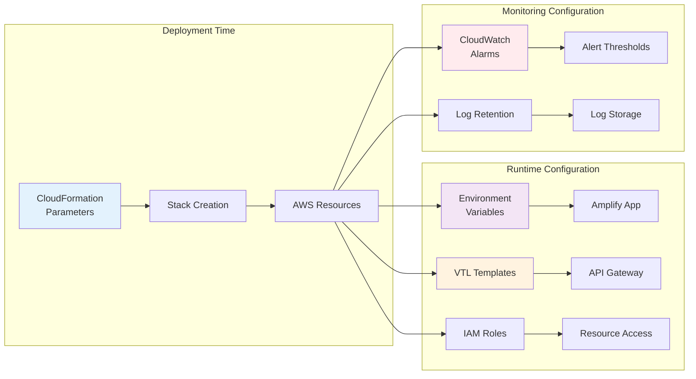

# URL Shortener Platform – Configuration Guide

## Overview

This guide documents all configuration options for the URL Shortener Platform, including CloudFormation parameters, environment variables, API Gateway settings, and runtime configuration.

---

## Configuration Overview



---

## Quick Reference Tables

### Essential Configuration Values

| Configuration | Location | Example Value | When to Change |
|---------------|----------|---------------|----------------|
| API Gateway URL | CloudFormation Output | `https://xbj96ig388.execute-api.ap-south-1.amazonaws.com/Prod` | Never (auto-generated) |
| CloudFront URL | CloudFormation Output | `https://d1234567890.cloudfront.net` | Never (auto-generated) |
| Cognito Client ID | CloudFormation Output | `1a2b3c4d5e6f7g8h9i0j` | Never (auto-generated) |
| Cognito Domain | Parameter | `user.wecare.digital` | Before deployment |
| Custom Domain | Parameter | `https://go.wecare.digital` | Before deployment |
| GitHub Token | Parameter | `ghp_xxxxxxxxxxxx` | Rotate every 90 days |
| DynamoDB Table | CloudFormation Output | `shortener-LinkTable-ABC123` | Never (auto-generated) |

### Environment-Specific Settings

| Setting | Development | Staging | Production |
|---------|-------------|---------|------------|
| AppName | `shortener-dev` | `shortener-staging` | `shortener` |
| UseLocalClient | `true` | `false` | `false` |
| CustomDomain | `https://dev.example.com` | `https://staging.example.com` | `https://go.example.com` |
| Log Retention | 7 days | 14 days | 30 days |
| Alarm Thresholds | Relaxed | Standard | Strict |
| MFA Enforcement | Optional | Required | Required |

---

## CloudFormation Parameters

These parameters are defined in `template.yaml` and can be overridden during deployment.

### AppName

**Type**: String  
**Default**: `shortener`  
**Description**: Name of the application (no spaces). Used as prefix for resource names.  
**Constraints**: Must be globally unique (used in S3 bucket names, Cognito domains, etc.)

**Example**:
```bash
sam deploy --parameter-overrides AppName=myshortener
```

**Resources Affected**:
- DynamoDB table name: `{AppName}-LinkTable-{UniqueId}`
- Cognito User Pool name: `{AppName}-UserPool`
- Cognito User Pool Client name: `{AppName}-UserPoolClient`
- Amplify app name: `Url-Shortener-Client`

---

### CustomDomainName

**Type**: String  
**Default**: `user.wecare.digital`  
**Description**: Custom domain for Cognito hosted UI (FQDN)  
**Constraints**: Must be a valid domain you own, ACM certificate required in `us-east-1`

**Example**:
```bash
sam deploy --parameter-overrides CustomDomainName=auth.example.com
```

**DNS Configuration Required**:
```
auth.example.com → {cognito-domain}.auth.ap-south-1.amazoncognito.com (CNAME)
```

**Resources Affected**:
- Cognito User Pool Domain
- Frontend `VUE_APP_AUTH_DOMAIN` environment variable

---

### UseLocalClient

**Type**: String  
**Default**: `false`  
**Allowed Values**: `true`, `false`  
**Description**: Enables `http://localhost:8080` as callback/logout URL for local development  
**Security**: Set to `false` in production (less secure)

**Example**:
```bash
# Development
sam deploy --parameter-overrides UseLocalClient=true

# Production
sam deploy --parameter-overrides UseLocalClient=false
```

**Resources Affected**:
- Cognito User Pool Client callback URLs
- Cognito User Pool Client logout URLs

---

### GithubRepository

**Type**: String  
**Required**: Yes  
**Description**: Forked GitHub repository URL for Amplify deployment  
**Format**: `https://github.com/USERNAME/REPO`

**Example**:
```bash
sam deploy --parameter-overrides GithubRepository=https://github.com/myuser/url-shortener
```

**Resources Affected**:
- Amplify App source repository

---

### PersonalAccessToken

**Type**: String  
**Required**: Yes  
**NoEcho**: true (hidden in CloudFormation console)  
**Description**: GitHub personal access token for Amplify to access repository  
**Scopes Required**: `repo`, `admin:repo_hook`

**Example**:
```bash
sam deploy --parameter-overrides PersonalAccessToken=ghp_xxxxxxxxxxxx
```

**Security**: Never commit this token to Git. Use environment variables or AWS Secrets Manager.

**Resources Affected**:
- Amplify App GitHub integration

---

### CustomDomain

**Type**: String  
**Default**: `none`  
**Description**: Custom domain for frontend (e.g., `https://go.wecare.digital`)  
**Constraints**: Must configure DNS and SSL certificate in Amplify Console manually

**Example**:
```bash
sam deploy --parameter-overrides CustomDomain=https://go.example.com
```

**Resources Affected**:
- Cognito User Pool Client callback URLs
- Cognito User Pool Client logout URLs

**Note**: This parameter only configures Cognito. You must manually add the custom domain in Amplify Console.

---

## Environment Variables

### Frontend (Vue.js)

These environment variables are configured in Amplify or `client/.env` file.

#### VUE_APP_NAME

**Type**: String  
**Required**: Yes  
**Description**: Application name displayed in UI  
**Example**: `shortener`

**Configuration**:
```bash
# In client/.env
VUE_APP_NAME=shortener

# Or in Amplify
aws amplify update-app \
  --app-id $AMPLIFY_APP_ID \
  --environment-variables VUE_APP_NAME=shortener
```

---

#### VUE_APP_CLIENT_ID

**Type**: String  
**Required**: Yes  
**Description**: Cognito User Pool Client ID  
**Example**: `1a2b3c4d5e6f7g8h9i0j`

**How to Get**:
```bash
# From CloudFormation outputs
aws cloudformation describe-stacks \
  --stack-name url-shortener-prod \
  --query 'Stacks[0].Outputs[?OutputKey==`VueAppClientId`].OutputValue' \
  --output text

# Or from Cognito Console
aws cognito-idp list-user-pool-clients \
  --user-pool-id {user-pool-id} \
  --region ap-south-1
```

---

#### VUE_APP_API_ROOT

**Type**: String (URL)  
**Required**: Yes  
**Description**: API Gateway base URL (via CloudFront)  
**Example**: `https://d1234567890.cloudfront.net`

**How to Get**:
```bash
# From CloudFormation outputs
aws cloudformation describe-stacks \
  --stack-name url-shortener-prod \
  --query 'Stacks[0].Outputs[?OutputKey==`VueAppAPIRoot`].OutputValue' \
  --output text
```

**Note**: Use CloudFront URL (not direct API Gateway URL) for better performance and caching.

---

#### VUE_APP_AUTH_DOMAIN

**Type**: String (URL)  
**Required**: Yes  
**Description**: Cognito custom domain URL  
**Example**: `https://user.wecare.digital`

**How to Get**:
```bash
# From CloudFormation outputs
aws cloudformation describe-stacks \
  --stack-name url-shortener-prod \
  --query 'Stacks[0].Outputs[?OutputKey==`VueAppAuthDomain`].OutputValue' \
  --output text
```

---

### Backend (API Gateway)

API Gateway uses context variables and VTL templates. No environment variables required.

**Available Context Variables**:
- `$context.requestTime` – Request timestamp (used for `timestamp` field)
- `$context.authorizer.claims.email` – User email from JWT (used for `owner` field)
- `$context.authorizer.claims.sub` – User ID from JWT
- `$input.path('$.fieldName')` – Extract field from request body
- `$input.json('$.fieldName')` – Extract field as JSON string

---

## API Gateway Configuration

### Integration Request Templates

#### GET /app (List User's Links)

**DynamoDB Action**: Query  
**Table**: `{AppName}-LinkTable-{UniqueId}`  
**Index**: `OwnerIndex`

**VTL Template**:
```velocity
{
  "TableName": "{table-name}",
  "IndexName": "OwnerIndex",
  "KeyConditionExpression": "#n_owner = :v_owner",
  "ExpressionAttributeValues": {
    ":v_owner": {"S": "$context.authorizer.claims.email"}
  },
  "ExpressionAttributeNames": {
    "#n_owner": "owner"
  }
}
```

**Key Configuration Points**:
- `owner` is extracted from JWT email claim (not from request)
- Uses `OwnerIndex` GSI for efficient queries
- Returns all links owned by authenticated user

---

#### POST /app (Create Link)

**DynamoDB Action**: UpdateItem  
**Table**: `{AppName}-LinkTable-{UniqueId}`

**VTL Template**:
```velocity
{
  "TableName": "{table-name}",
  "ConditionExpression": "attribute_not_exists(id)",
  "Key": {
    "id": {"S": $input.json('$.id')}
  },
  "ExpressionAttributeNames": {
    "#u": "url",
    "#o": "owner",
    "#ts": "timestamp",
    "#f": "folder",
    "#r": "remark"
  },
  "ExpressionAttributeValues": {
    ":u": {"S": $input.json('$.url')},
    ":o": {"S": "$context.authorizer.claims.email"},
    ":ts": {"S": "$context.requestTime"},
    ":f": {"S": $input.json('$.folder')},
    ":r": {"S": $input.json('$.remark')}
  },
  "UpdateExpression": "SET #u = :u, #o = :o, #ts = :ts, #f = :f, #r = :r",
  "ReturnValues": "ALL_NEW"
}
```

**Key Configuration Points**:
- `owner` is **always** set from JWT email (security: cannot be spoofed)
- `timestamp` is **always** set from API Gateway request time (consistency)
- `ConditionExpression` prevents duplicate IDs (returns 400 if ID exists)
- `folder` and `remark` are optional (from request body)

---

#### PUT /app/{linkId} (Update Link)

**DynamoDB Action**: UpdateItem  
**Table**: `{AppName}-LinkTable-{UniqueId}`

**VTL Template**:
```velocity
{
  "TableName": "{table-name}",
  "Key": {
    "id": {"S": "$input.params('linkId')"}
  },
  "ConditionExpression": "#o = :owner",
  "ExpressionAttributeNames": {
    "#u": "url",
    "#o": "owner",
    "#ts": "timestamp",
    "#f": "folder",
    "#r": "remark"
  },
  "ExpressionAttributeValues": {
    ":u": {"S": $input.json('$.url')},
    ":owner": {"S": "$context.authorizer.claims.email"},
    ":ts": {"S": "$context.requestTime"},
    ":f": {"S": $input.json('$.folder')},
    ":r": {"S": $input.json('$.remark')}
  },
  "UpdateExpression": "SET #u = :u, #ts = :ts, #f = :f, #r = :r",
  "ReturnValues": "ALL_NEW"
}
```

**Key Configuration Points**:
- `ConditionExpression` ensures user can only update their own links
- `owner` field is not updated (immutable)
- `timestamp` is updated to current request time

---

#### DELETE /app/{linkId} (Delete Link)

**DynamoDB Action**: DeleteItem  
**Table**: `{AppName}-LinkTable-{UniqueId}`

**VTL Template**:
```velocity
{
  "TableName": "{table-name}",
  "Key": {
    "id": {"S": "$input.params('linkId')"}
  },
  "ConditionExpression": "#o = :owner",
  "ExpressionAttributeNames": {
    "#o": "owner"
  },
  "ExpressionAttributeValues": {
    ":owner": {"S": "$context.authorizer.claims.email"}
  }
}
```

**Key Configuration Points**:
- `ConditionExpression` ensures user can only delete their own links
- Returns 400 if link doesn't exist or user doesn't own it

---

#### GET /{linkId} (Public Redirect)

**DynamoDB Action**: GetItem  
**Table**: `{AppName}-LinkTable-{UniqueId}`

**VTL Template**:
```velocity
{
  "TableName": "{table-name}",
  "Key": {
    "id": {"S": "$input.params('linkId')"}
  }
}
```

**Integration Response Template**:
```velocity
#set($inputRoot = $input.path('$'))
#if($inputRoot.Item.url.S)
  #set($context.responseOverride.status = 301)
  #set($context.responseOverride.header.Location = $inputRoot.Item.url.S)
  #set($context.responseOverride.header.Cache-Control = "public, max-age=300")
#else
  #set($context.responseOverride.status = 404)
#end
```

**Key Configuration Points**:
- No authentication required (public endpoint)
- Returns 301 redirect with `Location` header
- Returns 404 if link doesn't exist
- Cache-Control header allows 5-minute caching

---

### Integration Response Templates

#### GET /app Response

**VTL Template**:
```velocity
#set($inputRoot = $input.path('$'))
[
#foreach($elem in $inputRoot.Items)
  {
    "id": "$elem.id.S",
    "url": "$elem.url.S",
    "timestamp": "$elem.timestamp.S",
    "owner": "$elem.owner.S",
    "folder": "$util.defaultIfNull($elem.folder.S, '')",
    "remark": "$util.defaultIfNull($elem.remark.S, '')"
  }#if($foreach.hasNext),#end
#end
]
```

**Key Configuration Points**:
- Transforms DynamoDB response to JSON array
- Uses `$util.defaultIfNull` for optional fields (returns empty string instead of null)
- Includes all 6 fields: id, url, timestamp, owner, folder, remark

---

#### POST /app Response

**VTL Template**:
```velocity
#set($inputRoot = $input.path('$'))
{
  "id": "$inputRoot.Attributes.id.S",
  "url": "$inputRoot.Attributes.url.S",
  "timestamp": "$inputRoot.Attributes.timestamp.S",
  "owner": "$inputRoot.Attributes.owner.S",
  "folder": "$util.defaultIfNull($inputRoot.Attributes.folder.S, '')",
  "remark": "$util.defaultIfNull($inputRoot.Attributes.remark.S, '')"
}
```

**Key Configuration Points**:
- Transforms DynamoDB UpdateItem response to JSON object
- Returns the created item with all fields
- Uses `$util.defaultIfNull` for optional fields

---

### CORS Configuration

**Enabled on**: All `/app` endpoints and `/app/{linkId}` endpoints

**OPTIONS Method Configuration**:
- **Integration Type**: MOCK
- **Integration Request Template**: `{"statusCode": 200}`
- **Integration Response Headers**:
  - `Access-Control-Allow-Origin`: `'*'`
  - `Access-Control-Allow-Headers`: `'Content-Type,X-Amz-Date,Authorization,X-Api-Key,X-Amz-Security-Token'`
  - `Access-Control-Allow-Methods`: `'GET,POST,PUT,DELETE,OPTIONS'`
  - `Access-Control-Max-Age`: `'86400'` (24 hours)

**Method Response Headers** (on all authenticated endpoints):
- `Access-Control-Allow-Origin`: `'*'`
- `Cache-Control`: `'no-cache, no-store'` (on GET /app only)

**Security Considerations**:
- `Access-Control-Allow-Origin: *` allows any origin (suitable for public API)
- For stricter security, replace `*` with specific domain: `'https://go.wecare.digital'`
- `Access-Control-Max-Age: 86400` caches preflight response for 24 hours (reduces OPTIONS requests)

---

### Throttling Configuration

**Default Settings** (all endpoints except `/{linkId}`):
- **Rate Limit**: 2000 requests/second
- **Burst Limit**: 1000 requests

**Public Redirect Endpoint** (`GET /{linkId}`):
- **Rate Limit**: 10000 requests/second
- **Burst Limit**: 4000 requests

**Rationale**: Public redirect endpoint needs higher limits for viral links.

**How to Modify**:
Edit `template.yaml`:
```yaml
SiteAPI:
  Type: AWS::Serverless::Api
  Properties:
    MethodSettings:
      - HttpMethod: "*"
        ResourcePath: "/*"
        ThrottlingRateLimit: 2000
        ThrottlingBurstLimit: 1000
      - HttpMethod: "GET"
        ResourcePath: "/{linkId}"
        ThrottlingRateLimit: 10000
        ThrottlingBurstLimit: 4000
```

---

## DynamoDB Configuration

### Table Settings

**Billing Mode**: PAY_PER_REQUEST (on-demand)  
**Rationale**: Unpredictable traffic patterns, no capacity planning required

**Alternative** (for predictable high traffic):
```yaml
LinkTable:
  Type: AWS::DynamoDB::Table
  Properties:
    BillingMode: PROVISIONED
    ProvisionedThroughput:
      ReadCapacityUnits: 5
      WriteCapacityUnits: 5
```

---

### Global Secondary Index (OwnerIndex)

**Partition Key**: `owner` (String)  
**Projection Type**: ALL (all attributes included)  
**Billing Mode**: Same as table (PAY_PER_REQUEST)

**Purpose**: Efficiently query all links owned by a specific user

**Query Pattern**:
```
Query OwnerIndex WHERE owner = "r@wecare.digital"
```

**Performance**: Single-digit millisecond latency

---

### Attribute Definitions

Only key attributes need to be defined in CloudFormation:

```yaml
AttributeDefinitions:
  - AttributeName: id
    AttributeType: S
  - AttributeName: owner
    AttributeType: S
```

**Note**: Non-key attributes (url, timestamp, folder, remark) are not defined in schema (DynamoDB is schemaless).

---

## Cognito Configuration

### User Pool Settings

**MFA Configuration**:
```yaml
MfaConfiguration: ON  # Enforced for all users
EnabledMfas:
  - SOFTWARE_TOKEN_MFA  # TOTP authenticator apps
```

**Password Policy**:
```yaml
Policies:
  PasswordPolicy:
    MinimumLength: 8
    RequireUppercase: false
    RequireLowercase: false
    RequireNumbers: false
    RequireSymbols: false
```

**Auto-Verified Attributes**:
```yaml
AutoVerifiedAttributes:
  - email  # Email is auto-verified after sign-up
```

**Username Attributes**:
```yaml
UsernameAttributes:
  - email  # Users sign in with email (not username)
```

---

### User Pool Client Settings

**OAuth Configuration**:
```yaml
AllowedOAuthFlowsUserPoolClient: true
AllowedOAuthFlows:
  - code  # Authorization code grant
AllowedOAuthScopes:
  - email
  - openid
```

**Callback URLs** (dynamic based on parameters):
```yaml
CallbackURLs:
  - !Join [".", [https://master, !GetAtt AmplifyApp.DefaultDomain]]
  - !If [IsLocal, http://localhost:8080, !Ref "AWS::NoValue"]
  - !If [HasCustomDomain, !Ref CustomDomain, !Ref "AWS::NoValue"]
```

**Logout URLs**: Same as callback URLs

---

### Custom Domain Configuration

**Domain**: `user.wecare.digital`  
**Managed Login Version**: 2 (new Cognito hosted UI)  
**Certificate**: ACM certificate in `us-east-1` (required for Cognito)

**Certificate ARN** (hardcoded in template):
```yaml
CustomDomainConfig:
  CertificateArn: arn:aws:acm:us-east-1:010526260063:certificate/ab0fdc4d-ccbe-4aaf-a2e8-67ba98787223
```

**To Use Your Own Certificate**:
1. Request certificate in `us-east-1`:
   ```bash
   aws acm request-certificate \
     --domain-name your-domain.com \
     --validation-method DNS \
     --region us-east-1
   ```
2. Validate certificate via DNS
3. Update `template.yaml` with your certificate ARN
4. Redeploy stack

---

## CloudFront Configuration

### Cache Behavior

**Default TTL**: 0 seconds (no caching for API responses)  
**Rationale**: API responses are dynamic (user-specific)

**For Public Redirect Endpoint** (optional optimization):
Edit `template.yaml` to add path-specific cache behavior:
```yaml
CacheBehaviors:
  - PathPattern: "/{linkId}"
    DefaultTTL: 300  # 5 minutes
    MaxTTL: 3600     # 1 hour
    MinTTL: 0
    TargetOriginId: "URLShortenerAPIGW"
    ViewerProtocolPolicy: redirect-to-https
    ForwardedValues:
      QueryString: false
      Headers: []
```

---

### Custom Error Responses

```yaml
CustomErrorResponses:
  - ErrorCachingMinTTL: 0
    ErrorCode: 400
  - ErrorCachingMinTTL: 1
    ErrorCode: 403
  - ErrorCachingMinTTL: 5
    ErrorCode: 500
```

**Rationale**: Don't cache errors for long (users may retry immediately)

---

### Access Logs

**Enabled**: Yes  
**Bucket**: `CloudFrontAccessLogsBucket` (auto-created S3 bucket)  
**Prefix**: None (logs stored in root of bucket)

**Log Format**: Standard CloudFront access logs

**How to Query Logs**:
```bash
# Download logs
aws s3 sync s3://{bucket-name} ./cloudfront-logs/

# Analyze with AWS Athena (recommended)
# Create Athena table for CloudFront logs
# Query with SQL
```

---

## CloudWatch Configuration

### Alarms

All alarms send notifications to SNS topic `NotifyTopic`.

#### API Gateway 4xx Alarm

**Metric**: `4XXError`  
**Threshold**: > 1% average over 1 minute  
**Action**: SNS notification

**Rationale**: High 4xx rate indicates client errors (bad requests, auth failures)

---

#### API Gateway 5xx Alarm

**Metric**: `5XXError`  
**Threshold**: > 1% average over 1 minute  
**Action**: SNS notification

**Rationale**: 5xx errors indicate server-side issues (DynamoDB errors, integration failures)

---

#### API Gateway Latency Alarm

**Metric**: `Latency` (p99)  
**Threshold**: > 75ms over 5 minutes  
**Action**: SNS notification

**Rationale**: High latency indicates performance degradation

---

#### DynamoDB System Errors Alarm

**Metric**: `SystemErrors`  
**Threshold**: > 1% average over 1 minute  
**Action**: SNS notification

**Rationale**: System errors indicate DynamoDB service issues

---

#### DynamoDB User Errors Alarm

**Metric**: `UserErrors`  
**Threshold**: > 10% average over 1 minute  
**Action**: SNS notification

**Rationale**: High user error rate indicates client issues (conditional check failures, validation errors)

---

#### CloudFront Total Error Rate Alarm

**Metric**: `TotalErrorRate`  
**Threshold**: >= 5 errors over 1 minute  
**Action**: SNS notification

**Rationale**: High error rate indicates origin issues or cache misses

---

#### CloudFront Cache Hit Rate Alarm

**Metric**: `CacheHitRate`  
**Threshold**: <= 80% over 5 minutes  
**Action**: SNS notification

**Rationale**: Low cache hit rate indicates inefficient caching (higher costs, slower performance)

---

### SNS Topic Configuration

**Topic Name**: `NotifyTopic` (auto-generated name)

**How to Subscribe**:
```bash
# Get topic ARN
TOPIC_ARN=$(aws cloudformation describe-stacks \
  --stack-name url-shortener-prod \
  --query 'Stacks[0].Outputs[?OutputKey==`NotifyTopic`].OutputValue' \
  --output text)

# Subscribe email
aws sns subscribe \
  --topic-arn $TOPIC_ARN \
  --protocol email \
  --notification-endpoint your-email@example.com

# Confirm subscription via email
```

---

### Log Retention

**Default**: Indefinite (logs never expire)

**Recommended**: Set retention to 30 days to reduce costs

**How to Configure**:
```bash
# Set retention for API Gateway logs
aws logs put-retention-policy \
  --log-group-name /aws/apigateway/{api-id}/Prod \
  --retention-in-days 30 \
  --region ap-south-1
```

---

## IAM Roles and Permissions

### DDBReadRole

**Purpose**: Allow API Gateway to read from DynamoDB

**Permissions**:
```json
{
  "Version": "2012-10-17",
  "Statement": [
    {
      "Effect": "Allow",
      "Action": [
        "dynamodb:GetItem",
        "dynamodb:Scan",
        "dynamodb:Query"
      ],
      "Resource": [
        "arn:aws:dynamodb:ap-south-1:*:table/{table-name}",
        "arn:aws:dynamodb:ap-south-1:*:table/{table-name}/index/*"
      ]
    }
  ]
}
```

**Used By**: GET /{linkId}, GET /app

---

### DDBCrudRole

**Purpose**: Allow API Gateway to write to DynamoDB

**Permissions**:
```json
{
  "Version": "2012-10-17",
  "Statement": [
    {
      "Effect": "Allow",
      "Action": [
        "dynamodb:DeleteItem",
        "dynamodb:UpdateItem"
      ],
      "Resource": "arn:aws:dynamodb:ap-south-1:*:table/{table-name}"
    }
  ]
}
```

**Used By**: POST /app, PUT /app/{linkId}, DELETE /app/{linkId}

---

### AmplifyRole

**Purpose**: Allow Amplify to deploy and manage hosting

**Permissions**: `amplify:*` (full Amplify access)

**Used By**: Amplify App

---

### CloudWatchRole

**Purpose**: Allow API Gateway to write logs to CloudWatch

**Permissions**: `AmazonAPIGatewayPushToCloudWatchLogs` (managed policy)

**Used By**: API Gateway Account

---

## Security Best Practices

### 1. Rotate GitHub Personal Access Token

```bash
# Revoke old token in GitHub
# Generate new token
# Update CloudFormation parameter
sam deploy --parameter-overrides PersonalAccessToken=NEW_TOKEN
```

---

### 2. Restrict CORS Origins

Edit `api.yaml` to replace `*` with specific domain:
```yaml
Access-Control-Allow-Origin: 'https://go.wecare.digital'
```

---

### 3. Enable API Gateway Access Logs

Add to `template.yaml`:
```yaml
SiteAPI:
  Type: AWS::Serverless::Api
  Properties:
    AccessLogSetting:
      DestinationArn: !GetAtt ApiAccessLogGroup.Arn
      Format: '$context.requestId $context.error.message $context.error.messageString'
```

---

### 4. Enable DynamoDB Point-in-Time Recovery

Add to `template.yaml`:
```yaml
LinkTable:
  Type: AWS::DynamoDB::Table
  Properties:
    PointInTimeRecoverySpecification:
      PointInTimeRecoveryEnabled: true
```

---

### 5. Enable CloudTrail for Audit Logging

```bash
# Create CloudTrail trail
aws cloudtrail create-trail \
  --name url-shortener-audit \
  --s3-bucket-name {audit-bucket} \
  --region ap-south-1

# Start logging
aws cloudtrail start-logging \
  --name url-shortener-audit \
  --region ap-south-1
```

---

## Configuration Examples by Use Case

### Use Case 1: Small Team (5-10 users)

**Recommended Configuration**:
```yaml
# CloudFormation Parameters
AppName: team-shortener
CustomDomainName: links.team.com
UseLocalClient: false
CustomDomain: https://go.team.com

# DynamoDB
BillingMode: PAY_PER_REQUEST  # Cost-effective for low traffic

# API Gateway Throttling
DefaultRateLimit: 1000  # requests/sec
DefaultBurstLimit: 500

# CloudWatch Alarms
4xxErrorThreshold: 5%  # Relaxed for small team
5xxErrorThreshold: 1%
LatencyThreshold: 100ms

# Log Retention
LogRetention: 14 days  # Balance cost and debugging needs
```

**Expected Cost**: ~$2-5/month

---

### Use Case 2: Marketing Department (50-100 users)

**Recommended Configuration**:
```yaml
# CloudFormation Parameters
AppName: marketing-shortener
CustomDomainName: links.marketing.com
UseLocalClient: false
CustomDomain: https://go.marketing.com

# DynamoDB
BillingMode: PAY_PER_REQUEST  # Handles campaign spikes

# API Gateway Throttling
DefaultRateLimit: 5000  # requests/sec
DefaultBurstLimit: 2000
PublicRedirectRateLimit: 20000  # Higher for campaigns

# CloudWatch Alarms
4xxErrorThreshold: 2%
5xxErrorThreshold: 0.5%
LatencyThreshold: 75ms

# Log Retention
LogRetention: 30 days  # Compliance requirements
```

**Expected Cost**: ~$20-50/month (depending on campaign traffic)

---

### Use Case 3: Enterprise (1000+ users)

**Recommended Configuration**:
```yaml
# CloudFormation Parameters
AppName: enterprise-shortener
CustomDomainName: auth.company.com
UseLocalClient: false
CustomDomain: https://go.company.com

# DynamoDB
BillingMode: PROVISIONED  # Cost-effective at scale
ReadCapacityUnits: 100
WriteCapacityUnits: 50
AutoScaling: Enabled

# API Gateway Throttling
DefaultRateLimit: 10000  # requests/sec
DefaultBurstLimit: 5000
PublicRedirectRateLimit: 50000

# CloudWatch Alarms
4xxErrorThreshold: 1%
5xxErrorThreshold: 0.1%
LatencyThreshold: 50ms

# Log Retention
LogRetention: 90 days  # Compliance and audit

# Additional Security
APIGatewayAccessLogs: Enabled
CloudTrail: Enabled
DynamoDBPITR: Enabled
```

**Expected Cost**: ~$200-500/month (depending on traffic)

---

## Advanced Configuration Patterns

### Pattern 1: Multi-Region Deployment

**Scenario**: Deploy to multiple regions for global users.

**Configuration**:
```yaml
# Primary Region: ap-south-1
PrimaryRegion: ap-south-1
PrimaryDomainName: user-asia.wecare.digital
PrimaryCustomDomain: https://go-asia.wecare.digital

# Secondary Region: us-east-1
SecondaryRegion: us-east-1
SecondaryDomainName: user-us.wecare.digital
SecondaryCustomDomain: https://go-us.wecare.digital

# DynamoDB Global Tables
GlobalTableEnabled: true
ReplicationRegions:
  - us-east-1
  - eu-west-1
  - ap-south-1

# Route 53 Geolocation Routing
GeolocationRouting: Enabled
```

**Benefits**:
- Lower latency for global users
- High availability (multi-region failover)
- Data replication across regions

---

### Pattern 2: Development + Production Isolation

**Scenario**: Separate dev and prod environments with different configurations.

**Development Configuration**:
```yaml
StackName: url-shortener-dev
AppName: shortener-dev
CustomDomainName: user-dev.wecare.digital
UseLocalClient: true  # Allow localhost
CustomDomain: https://dev.wecare.digital

# Relaxed settings for development
MfaConfiguration: OPTIONAL
LogLevel: DEBUG
AlarmThresholds: Relaxed
CostOptimization: Disabled
```

**Production Configuration**:
```yaml
StackName: url-shortener-prod
AppName: shortener
CustomDomainName: user.wecare.digital
UseLocalClient: false  # No localhost
CustomDomain: https://go.wecare.digital

# Strict settings for production
MfaConfiguration: ON
LogLevel: INFO
AlarmThresholds: Strict
CostOptimization: Enabled
```

---

### Pattern 3: High-Traffic Optimization

**Scenario**: Optimize for high-traffic scenarios (1M+ requests/day).

**Configuration**:
```yaml
# API Gateway
CachingEnabled: true
CacheTTL: 300  # 5 minutes
CacheClusterSize: "6.1"  # 6.1 GB cache

# CloudFront
DefaultTTL: 300  # 5 minutes for public redirects
MaxTTL: 3600  # 1 hour
MinTTL: 60  # 1 minute

# DynamoDB
BillingMode: PROVISIONED
ReadCapacityUnits: 500
WriteCapacityUnits: 100
AutoScaling:
  Enabled: true
  MinCapacity: 100
  MaxCapacity: 1000
  TargetUtilization: 70%

# ElastiCache (optional)
ElastiCacheEnabled: true
CacheNodeType: cache.t3.micro
NumCacheNodes: 2
```

**Benefits**:
- Reduced latency (caching at multiple layers)
- Lower costs (fewer DynamoDB requests)
- Better performance under load

---

## Troubleshooting Configuration Issues

### Issue: Environment Variables Not Applied

**Symptoms**:
- Frontend shows "undefined" for API URL
- Authentication fails with "Invalid client ID"

**Diagnosis**:
```bash
# Check Amplify environment variables
aws amplify get-app --app-id {app-id} --query 'app.environmentVariables'
```

**Solution**:
```bash
# Re-apply environment variables
aws amplify update-app \
  --app-id {app-id} \
  --environment-variables \
    VUE_APP_NAME=shortener,\
    VUE_APP_CLIENT_ID={client-id},\
    VUE_APP_API_ROOT={api-url},\
    VUE_APP_AUTH_DOMAIN={auth-domain}

# Trigger rebuild
aws amplify start-job --app-id {app-id} --branch-name master --job-type RELEASE
```

---

### Issue: CORS Errors in Browser

**Symptoms**:
- Browser console shows "CORS policy" error
- API requests fail with no response

**Diagnosis**:
```bash
# Test OPTIONS request
curl -X OPTIONS https://your-api-url/app \
  -H "Origin: https://your-frontend-url" \
  -H "Access-Control-Request-Method: GET" \
  -H "Access-Control-Request-Headers: Authorization" \
  -v
```

**Solution**:
1. Verify OPTIONS method exists in API Gateway
2. Check CORS headers in Integration Response:
   ```
   Access-Control-Allow-Origin: '*'
   Access-Control-Allow-Headers: 'Content-Type,Authorization,...'
   Access-Control-Allow-Methods: 'GET,POST,PUT,DELETE,OPTIONS'
   ```
3. Redeploy API Gateway
4. Clear browser cache

---

### Issue: DynamoDB Throttling

**Symptoms**:
- 503 errors from API
- CloudWatch shows ProvisionedThroughputExceededException

**Diagnosis**:
```bash
# Check DynamoDB metrics
aws cloudwatch get-metric-statistics \
  --namespace AWS/DynamoDB \
  --metric-name UserErrors \
  --dimensions Name=TableName,Value={table-name} \
  --start-time 2025-12-09T00:00:00Z \
  --end-time 2025-12-09T23:59:59Z \
  --period 300 \
  --statistics Sum
```

**Solution**:
```yaml
# Switch to on-demand billing
BillingMode: PAY_PER_REQUEST

# Or increase provisioned capacity
ReadCapacityUnits: 200  # Double current capacity
WriteCapacityUnits: 100

# Enable auto-scaling
AutoScaling: Enabled
```

---

### Issue: High CloudWatch Costs

**Symptoms**:
- CloudWatch bill higher than expected
- Log storage growing rapidly

**Diagnosis**:
```bash
# Check log group sizes
aws logs describe-log-groups \
  --query 'logGroups[*].[logGroupName,storedBytes]' \
  --output table
```

**Solution**:
```bash
# Set log retention
aws logs put-retention-policy \
  --log-group-name /aws/apigateway/{api-id}/Prod \
  --retention-in-days 7

# Delete old log streams
aws logs delete-log-stream \
  --log-group-name /aws/apigateway/{api-id}/Prod \
  --log-stream-name {old-stream-name}
```

---

## Configuration Validation

### Pre-Deployment Validation

**Checklist**:
```bash
# 1. Validate CloudFormation template
sam validate

# 2. Check parameter values
cat samconfig.toml

# 3. Verify AWS credentials
aws sts get-caller-identity

# 4. Check region
aws configure get region

# 5. Verify GitHub token
curl -H "Authorization: token $GITHUB_TOKEN" https://api.github.com/user

# 6. Check ACM certificate (if using custom domain)
aws acm list-certificates --region us-east-1

# 7. Verify DNS configuration (if using custom domain)
nslookup user.wecare.digital
```

---

### Post-Deployment Validation

**Checklist**:
```bash
# 1. Verify stack status
aws cloudformation describe-stacks \
  --stack-name url-shortener-prod \
  --query 'Stacks[0].StackStatus'

# 2. Test API Gateway
curl -I https://your-api-url/google

# 3. Test authentication
# Open browser: https://user.wecare.digital/login

# 4. Check Amplify build
aws amplify list-jobs --app-id {app-id} --branch-name master --max-results 1

# 5. Verify CloudWatch alarms
aws cloudwatch describe-alarms --state-value ALARM

# 6. Check DynamoDB table
aws dynamodb describe-table --table-name {table-name}

# 7. Test frontend
# Open browser: https://go.wecare.digital
```

---

## Configuration Checklist

**CloudFormation Parameters:**
- [ ] AppName set to unique value
- [ ] CustomDomainName configured with valid domain
- [ ] UseLocalClient set to `false` in production
- [ ] GithubRepository set to your forked repo
- [ ] PersonalAccessToken set (keep secret)
- [ ] CustomDomain configured (if using)

**Environment Variables:**
- [ ] VUE_APP_NAME set in Amplify
- [ ] VUE_APP_CLIENT_ID set in Amplify
- [ ] VUE_APP_API_ROOT set in Amplify
- [ ] VUE_APP_AUTH_DOMAIN set in Amplify

**API Gateway:**
- [ ] VTL templates configured correctly
- [ ] CORS headers configured
- [ ] Throttling limits set appropriately
- [ ] CloudWatch logging enabled

**DynamoDB:**
- [ ] OwnerIndex GSI created
- [ ] Billing mode set (on-demand or provisioned)
- [ ] Point-in-time recovery enabled (optional)

**Cognito:**
- [ ] MFA enforced
- [ ] Custom domain configured with ACM certificate
- [ ] Callback/logout URLs configured
- [ ] Password policy set

**CloudFront:**
- [ ] Origin configured to API Gateway
- [ ] Cache behavior configured
- [ ] Access logs enabled
- [ ] Custom domain configured (optional)

**CloudWatch:**
- [ ] All alarms created
- [ ] SNS topic subscribed
- [ ] Log retention configured
- [ ] Dashboard created (optional)

**Security:**
- [ ] IAM roles follow least-privilege principle
- [ ] CORS origins restricted (optional)
- [ ] API Gateway access logs enabled (optional)
- [ ] CloudTrail enabled (optional)

---

**Document Version**: 1.0  
**Last Updated**: December 9, 2025  
**Maintained By**: DevOps Team
